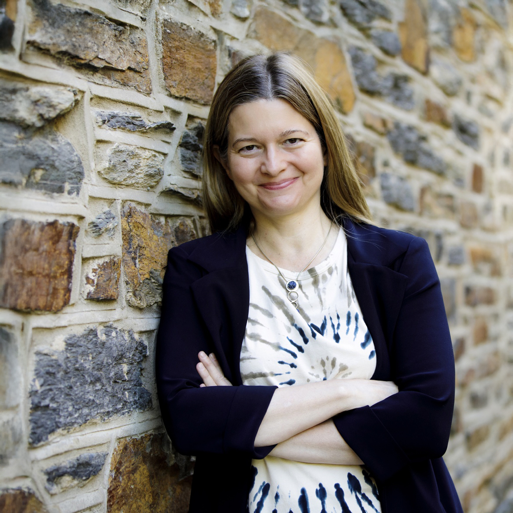
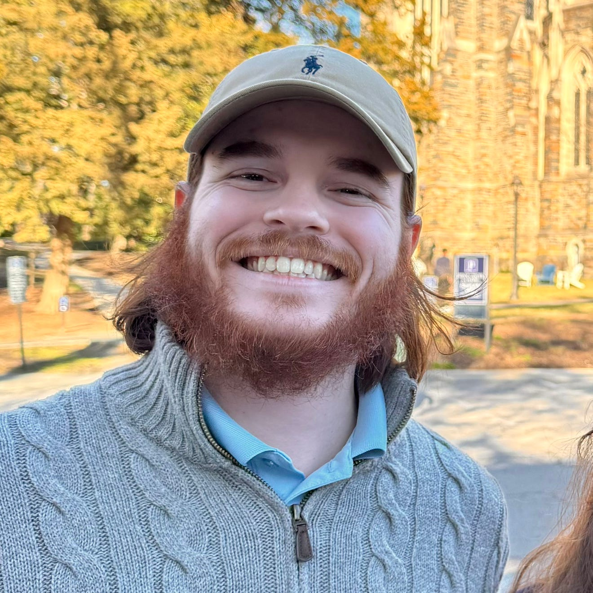

## Instructor

{.circular-portrait-mine style="float:right;padding: 0 0 0 10px;" fig-alt="Headshot of Dr. Amy Herring"}

[**Dr. Amy Herring**](https://scholars.duke.edu/person/Amy.Herring) (she/her) is Sara & Charles Ayres Distinguished Professor of Statistical Science and Dean of the Natural Sciences at Duke University. She also holds faculty appointments in Duke's Global Health Institute and Department of Biostatistics and Bioinformatics. She develops innovative statistical methods to better understand complex data in health and medicine, with applications in areas such as global health, environmental health, and maternal and child health. Her research uses tools such as Bayesian methods and health data science to uncover patterns in data and address important real-world health questions.

## Teaching assistant {#teaching-assistants}

{.circular-portrait-mine style="float:right;padding: 0 0 0 10px;" fig-alt="Headshot of Mr. George Nowacek"}

[**Mr. George Nowacek**](https://scholars.duke.edu/person/George.Nowacek) is earning his master's degree in Statistical Science at Duke University. A long-time Triangle resident, he is a great resource not only for STA 198 but also for local questions.

Name| Office hours                                   | Location     |
|----|------------------------------------------------|--------------|
|Prof. Herring | Mon 4-5pm & Wed 1-2pm* | Allen 102C  |
| George Nowacek| Tues 5-6pm & Fri 1-2pm | Old Chem 203B |

Note for Prof. Herring: Wednesday lunches 1-2 are available on request!  Prof. Herring's office hours are modified or cancelled (e-mail for a replacement 1:1 meeting) the following days due to holidays or conflicts: Monday 9/7 (Labor Day), Monday 9/28 (4:30-5:30), Monday 10/12 (Fall Break), Wednesday 11/18, Monday 11/23 (4-4:30 only), Wednesday 11/25 (Thanksgiving), Monday 11/30 (4:30-5:30).

