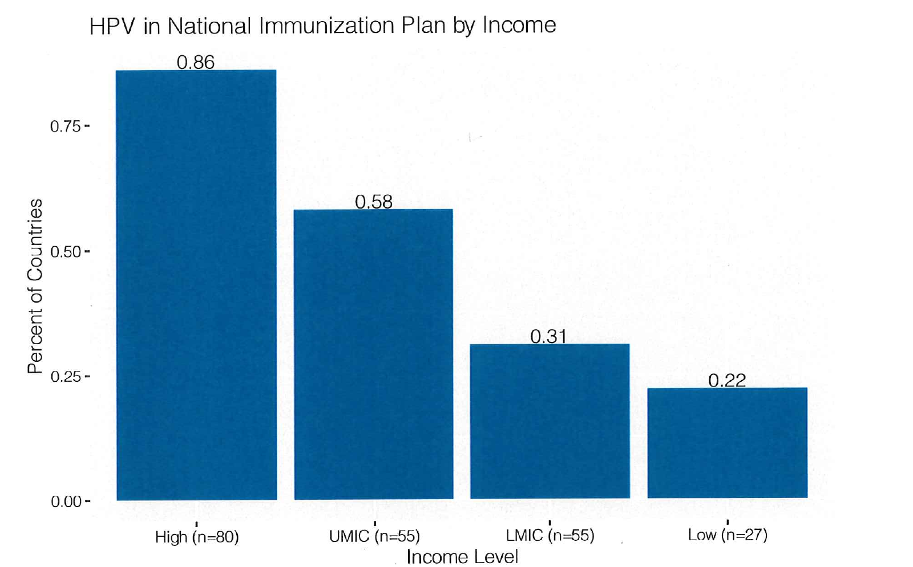
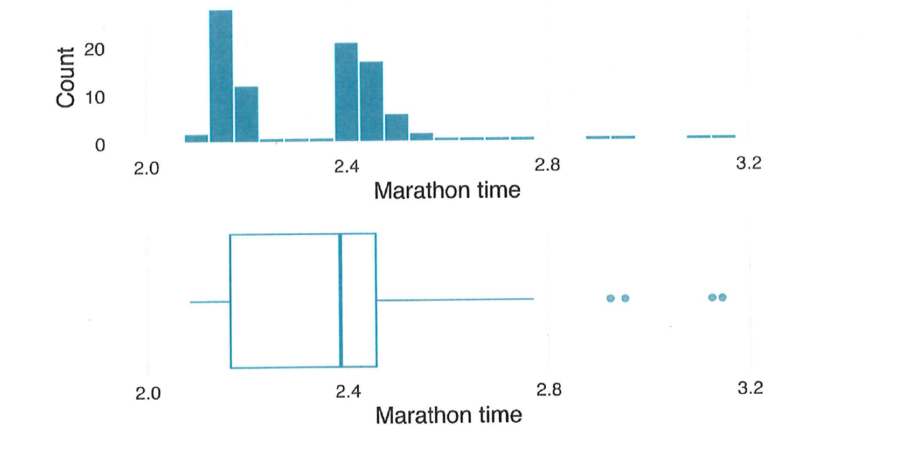
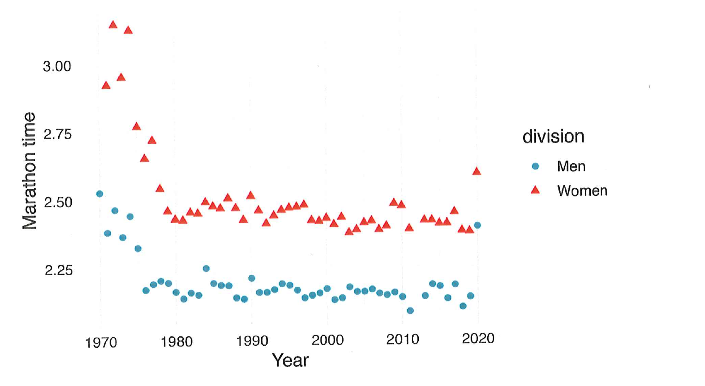

---
format:
  pdf:
    documentclass: article
    papersize: letter
    fontsize: 11pt
    geometry:
      - margin=0.78in
    toc: false
    number-sections: false
    keep-tex: true
    include-in-header:
      text: |
        \usepackage{amsmath,amssymb}
        \usepackage{fancyhdr}
        \setlength{\headheight}{14pt}
        \pagestyle{fancy}
        \fancyhf{}
        \renewcommand{\headrulewidth}{0pt}
        \cfoot{\thepage}
        \setlength{\parindent}{0pt}
        \setlength{\parskip}{0.55em}
execute:
  enabled: false
editor: source
---

\begin{center}
{\LARGE Exam 1, Fall 2021}\\[1.2em]
Date: \rule{1.6in}{0.4pt}
\end{center}

\vspace{2.3em}

First name: \rule{2.05in}{0.4pt}\hfill Last name: \rule{2.05in}{0.4pt}

\vspace{2.2em}

**HONOR STATEMENT:** I have neither given nor received aid on this examination.

\vspace{2em}

Signature: \rule{5.2in}{0.4pt}

\vspace{2.5em}

This is a closed-book, closed-note exam. Calculators or other electronic devices are not allowed. Note that throughout the exam, full credit is given even when calculations are fully outlined but not complete, i.e. $\displaystyle \frac{\frac{1}{2}\times 4+\frac{8}{4}}{2}$ receives the same credit as an answer of 2.

\vspace{2em}

Possibly helpful equations:

If $X$ is a binomial random variable, its distribution is given by

$$
P(X=x)=\binom{n}{x}\pi^x(1-\pi)^{n-x},
$$

where $\pi$ is the probability of success, and $n$ is the number of independent trials.

\vspace{1.5em}

For events $A$ and $B$, Bayes' theorem tells us

$$
P(A\mid B)=\frac{P(B\mid A)P(A)}{P(B)}=\frac{P(B\cap A)}{P(B)}.
$$

\newpage

# Climate Action {.unnumbered}

On September 22, 2021, the World Health Organization launched new Global Air Quality Guidelines to help guide legislation and policies to reduce levels of air pollutants and decrease the burden of disease resulting from pollutant exposures (WHO, 2021). You wish to study compliance with the air quality guidelines for fine particulate matter (PM$_{2.5}$) and nitrogen dioxide (NO$_2$). In order to do this, you take a random sample of 100 world cities. For each of the items below, indicate whether it is an example of a population parameter, a sample statistic, an observation, or a variable by circling the one best answer.

**1.** *(2 points)* A binary indicator of whether or not each sampled city is in compliance with the PM$_{2.5}$ guideline

population parameter \hfill sample statistic \hfill observation \hfill variable

\vspace{0.6em}

**2.** *(2 points)* The fraction (out of 100) of PM$_{2.5}$ levels for cities in your sample that exceed the new Global Air Quality Guidelines

population parameter \hfill sample statistic \hfill observation \hfill variable

\vspace{0.6em}

**3.** *(2 points)* The average (over 100 cities) of the NO$_2$ levels for cities in your sample

population parameter \hfill sample statistic \hfill observation \hfill variable

\vspace{0.6em}

**4.** *(2 points)* The % of all cities in the world that are out of compliance with the new Global Air Quality Guidelines

population parameter \hfill sample statistic \hfill observation \hfill variable

\vspace{0.6em}

**5.** *(2 points)* One of the cities in your random sample

population parameter \hfill sample statistic \hfill observation \hfill variable

\newpage

# Flu Season {.unnumbered}

Flu season is coming! Consider a collection of two-parent families. For purposes of this exercise, we will refer to the parents as parent 1 and parent 2. Suppose the probability that at least one parent has the flu is 0.14 and the probability that both parents have the flu is 0.06.

\vspace{1.8em}

**6.** *(8 points)* Suppose the probability Parent 1 has the flu, $\pi_1$, is the same as the probability that Parent 2 has the flu, $\pi_2$. Calculate this probability.

\vspace{2in}

**7.** *(8 points)* Given that Parent 1 has the flu, what is the conditional probability that Parent 2 has the flu?

\vspace{1.7in}

\newpage

**8.** *(8 points)* Given that Parent 1 does not have the flu, what is the conditional probability that Parent 2 has the flu?

\vspace{2.25in}

**9.** *(8 points)* Are the events Parent 1 having the flu and Parent 2 having the flu independent? Provide a mathematical justification for your answer.

\vspace{2.4in}

\newpage

# Global Effort to End Cervical Cancer {.unnumbered}

In 2020, the World Health Organization launched a global effort to end cervical cancer. 99% of cervical cancer cases can be tied to HPV infection. The bar chart shows the percentage of countries who have made HPV vaccination a part of their national immunization program, broken out by World Bank income status. In 2020, there were 80 countries in the high income group, 55 upper-middle income countries (UMIC), 55 lower-middle income countries (LMIC), and 27 in the low income group.

{fig-align="center" width="86%"}

Let $H$ be the event a country has HPV in its national immunization plan and $L$ be the event that a country is a low-income country.

Find the requested probabilities. If you need additional information to calculate a probability, state what is needed.

**10.** *(8 points)* What is $P(L)$, the probability that a country is a low income country?

\newpage

**11.** *(8 points)* What is $P(H)$, the probability that a country has HPV in its national immunization plan?

\vspace{3.7in}

**12.** *(8 points)* What is $P(H\mid L)$, the conditional probability that a low income country has HPV in its national immunization plan?

\vspace{1.25in}

\newpage

**13.** *(8 points)* What is $P(L\mid H)$, the conditional probability that a country is a low income country given that it has HPV in its national immunization plan?

\vspace{5.9in}

\newpage

**14.** *(8 points)* Suppose a global health student is surveying countries about their national immunization plans and takes a completely random sample of size $n=10$ from this group of 217 countries. What is the probability that this sample will contain more than one low-income country?

\vspace{5.9in}

\newpage

# Limits of Human Speed and Endurance {.unnumbered}

The New York City Marathon is the largest marathon in the world and attracts elite runners worldwide (in fact Kenya has more open division winners than the US!). *OpenIntro Introduction to Modern Statistics* has an interesting example that shows time to completion (in hours) of winners in both overall/open divisions of the New York City marathon from 1970--2020 (the 2021 marathon is in November).

{fig-align="center" width="91%"}

**15.** *(6 points)* What features of the distribution of winning times are apparent in the histogram but not in the box plot? Your answer should be based *only* on the features in this histogram and box plot.

\vspace{1.15in}

\newpage

Below a time series plot of the winning times is provided. Note that 2020 was an anomaly due in part to the marathon's being held as a virtual event and that the 2012 marathon was not held due to a natural disaster (Hurricane Sandy).

{fig-align="center" width="87%"}

**16.** *(6 points)* What are the two primary advantages of this time series plot over the histogram and box plot on the previous page?

\vspace{2in}

\newpage

**17.** *(6 points)* With this time series plot in mind, what is the best way to adapt the histogram or box plot on the previous page to be more informative?

\vspace{5.8in}
