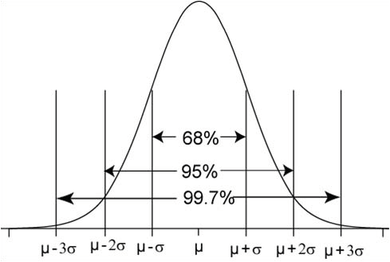
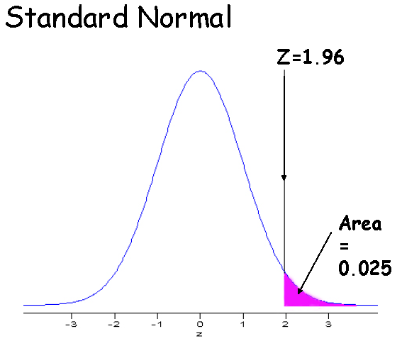
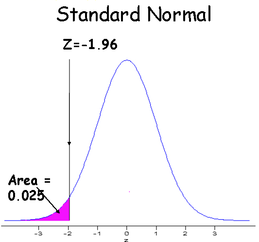
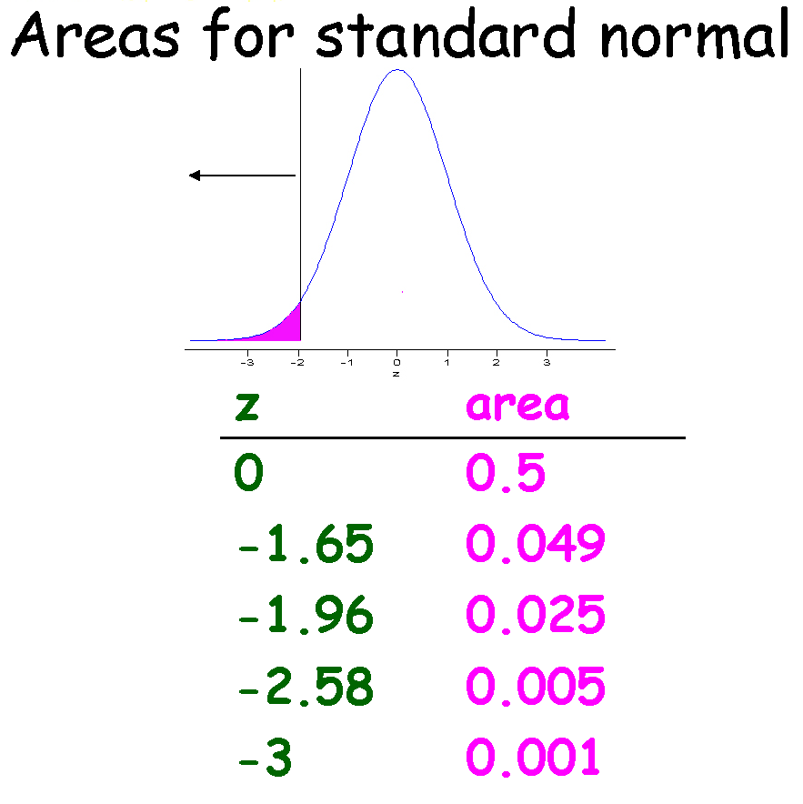
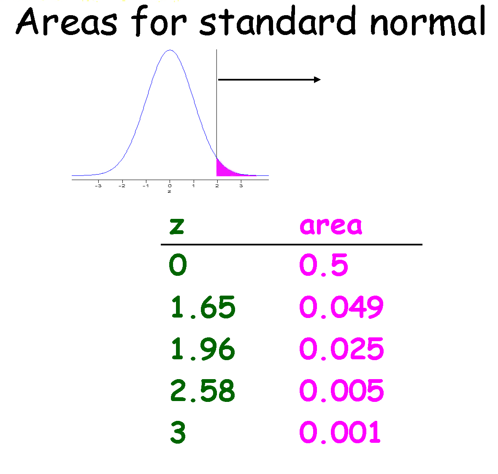
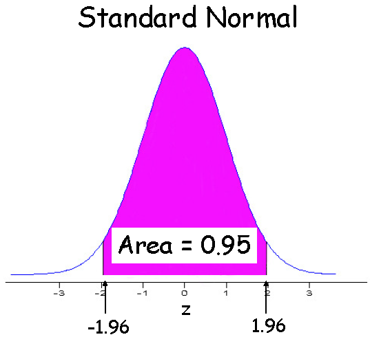
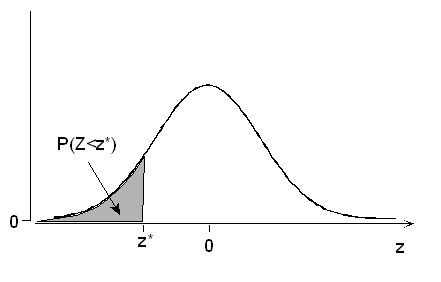
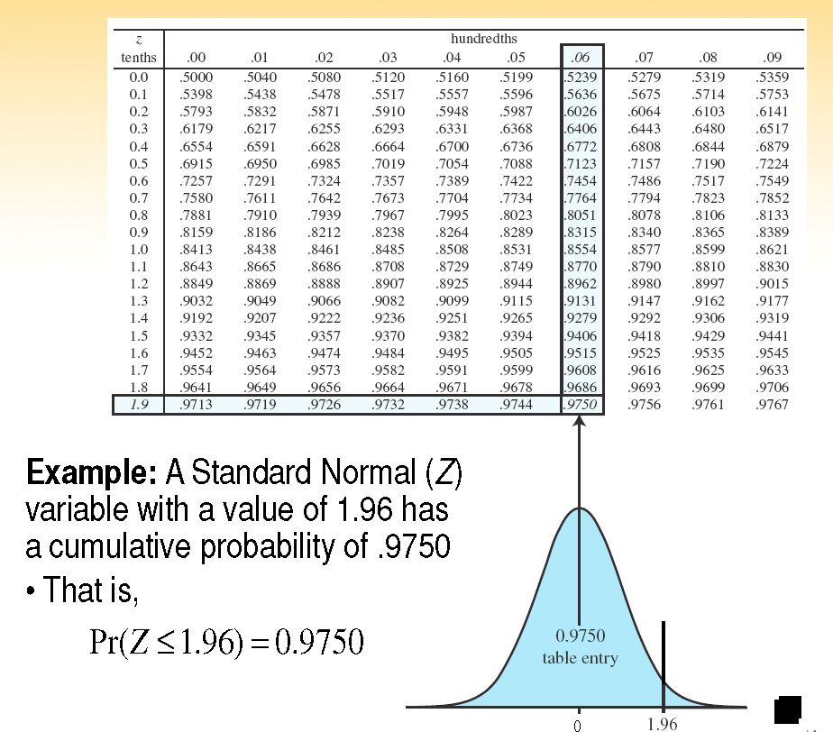
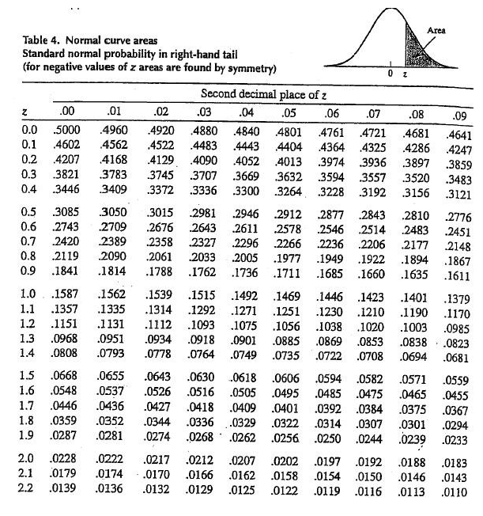
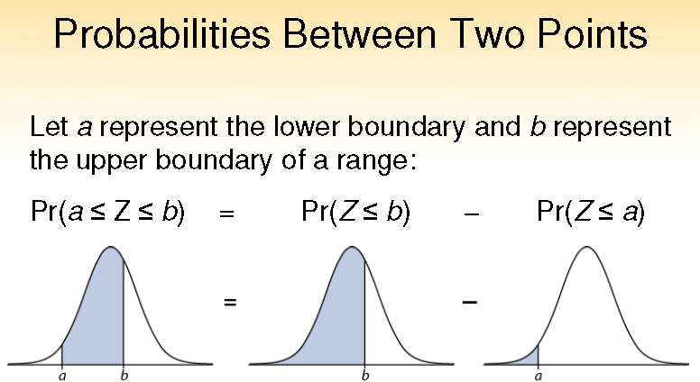

```{r, child="setup.Rmd", echo=FALSE}
```


```{r}
#| label: packages
#| echo: false
#| message: false
#| warning: false

library(tidyverse)
library(knitr)

```

## Normal Distribution

In this slide deck, we explore the *normal distribution*, one of the primary inferential tools in statistical science! 

The normal distribution is commonly called the *Gaussian distribution* after [Carl Friedrich Gauss](https://en.wikipedia.org/wiki/Carl_Friedrich_Gauss), who wrote down the equations governing it in the early 1800's. It is also sometimes referred to as a *bell curve*.

## Birth Weight

<div style="font-size:0.6em;">

We consider birth weight data for US (full term) births in 2024 from the National Center for Health Statistics. For simplicity, we consider weight rounded to the nearest pound.

If we want to estimate the probablity that a baby delivered at term weighs less than 6 pounds, we just add up the probabilities associated with the bars for birth weights under 6 pounds (this will be an error-prone estimate given that weights of 5.5 were rounded up to 6 for simplicity, but just imagine each baby weighed exactly an integer number of pounds for now). For births of 8-9 pounds, we just add up the probabilities associated with those two bars, and so forth.

</div>


```{r}
#| label: Birth Weight
#| echo: false


load("../data/births.RData")
#| label: clean-birthweight

births <- births_raw %>%
  filter(combgest >= 37 & combgest <= 45) %>%
  filter(dbwt != "9999") %>%
  mutate(
    bwt = as.numeric(dbwt),
    bwt_lb = round(bwt / 453.592)
  )

#| label: bwt-barplot

births %>%
  ggplot(aes(x = factor(bwt_lb))) +
  geom_bar(aes(y = after_stat(count) / sum(after_stat(count))), fill = "#4C72A8") +
  scale_y_continuous(labels = scales::label_number(accuracy = 0.01)) +
  labs(
    title = "Distribution of Birth Weight",
    x = "Birth Weight (lbs)",
    y = "Proportion"
  ) +
  theme_minimal()

```

## Continuous Distribution

Birth weight is a continuous quantity, and in hospitals it is measured in g for much higher resolution. Let's consider the distribution of birth weight in g.

```{r}
#| echo: false

ggplot(data = data.frame(x = c(500,6000)), aes(x)) +
  stat_function(fun = dnorm, args = list(mean =3250, sd = 600)) + ylab("") +
  scale_y_continuous(labels = scales::label_number()) +
  labs (x = "Birth Weight (g)",
        y = "Density")
```

The *probability density curve* can be used to get the probability of any range of birth weights we would like to investigate.

## {background-color="white"}

```{r}
#| echo: false

ggplot(data = data.frame(x = c(500,6000)), aes(x)) +
  stat_function(fun = dnorm, args = list(mean =3250, sd = 600)) +
  stat_function(fun = dnorm, args = list(mean=3250, sd=600), xlim=c(3000,3500), geom = "area", fill = "#003087", alpha=0.3) +
  scale_y_continuous(labels = scales::label_number()) +
  labs (x = "Birth Weight (g)", y = "")

```

For example, we can calculate probabilities under the normal distribution, such as the probability a baby weighs between 3000 and 3500 grams.

## Continuous Probability Distributions

<div style="font-size:0.6em;">

- Density curves, like histograms, can have a wide variety of shapes.  The area under a density curve is always 1.
  - How do you find the area of interest in a plot?
  - Calculus! $$Pr(a \leq X \leq b)=\textrm{area between a and b below the curve}=\int_a^b f(x)dx$$ where $f(x)$ represents the density curve
  - While you will need to know calculus for courses like STA 240, for STA 198/ GLHLTH 298, we can rely on R to provide the probabilities we need.
- We will see density curves for several important distributions -- normal, $t$, $\chi^2$, and $F$ random variables (coming this fall!)

</div>

## Normal Distribution

For the normal distribution, $$f(x)=\frac{1}{\sqrt{2\pi\sigma^2}}\exp\left\{-\frac{1}{2}\frac{(x-\mu)^2}{\sigma^2}\right\},$$
where the mean is given by $\mu$, the variance by $\sigma^2$, and the standard deviation by $\sigma$.  The notation $N(\mu,\sigma^2)$ is often used.


Also called the Gaussian distribution or bell curve, this distribution is symmetric.

## {background-color="white"}

```{r}
#| echo: false
#| label: three-normals


ggplot(data = data.frame(x = c(500, 6000)), aes(x)) +
  stat_function(fun = dnorm, args = list(mean = 3250, sd = 600), 
                color = "#2B547E", linewidth = 1) +
  stat_function(fun = dnorm, args = list(mean = 3250, sd = 1000), 
                color = "#A6617B", linewidth = 1) +
  stat_function(fun = dnorm, args = list(mean = 2500, sd = 400), 
                color = "#1E5B45", linewidth = 1) +
  stat_function(fun = dnorm, args = list(mean = 4000, sd = 600), 
                color = "#1E5B45", linewidth = 1) +  scale_x_continuous(breaks = seq(1000, 5000, by = 1000)) +
  labs(x = "Birth Weight (g)", y = NULL) +
  theme_minimal() +
  theme(
    panel.grid = element_blank(),
    axis.text.y = element_blank(),
    axis.ticks.y = element_blank()
  )
```

Which of these normal curves has the biggest mean?  Standard deviation?

## Standard Deviation Rule for the Normal Distribution

A useful rule for normal distributions is that roughly 68% of the area under the curve is within one standard deviation $\sigma$ of the mean, 95% is within $2\sigma$, and 99.7% is within $3\sigma$.

```{r echo=FALSE, out.width="50%"}

```

## {background-color="white"}

The symmetry of the normal distribution also allows us to calculate the probability of values falling in the tails. (This birth weight distribution has mean 3250g and sd 600g.)

```{r}
#| label: birthweight-95-interval
#| echo: false

bwt_mean <- 3250
bwt_sd   <- 600

lower <- bwt_mean - 2 * bwt_sd
upper <- bwt_mean + 2 * bwt_sd

ggplot(data.frame(x = c(bwt_mean - 4*bwt_sd, bwt_mean + 4*bwt_sd)), aes(x)) +
  stat_function(fun = dnorm, args = list(mean = bwt_mean, sd = bwt_sd),
                geom = "area", fill = "#B7CEE2", color = "black") +
  stat_function(fun = dnorm, args = list(mean = bwt_mean, sd = bwt_sd),
                xlim = c(bwt_mean - 4*bwt_sd, lower),
                geom = "area", fill = "#2B547E", color = "black") +
  stat_function(fun = dnorm, args = list(mean = bwt_mean, sd = bwt_sd),
                xlim = c(upper, bwt_mean + 4*bwt_sd),
                geom = "area", fill = "#2B547E", color = "black") +
  annotate("text", x = bwt_mean, y = dnorm(bwt_mean, bwt_mean, bwt_sd) * 0.4,
           label = "95%", size = 8) +
  annotate("text", x = lower - 350, y = dnorm(lower, bwt_mean, bwt_sd) * 3,
           label = "2.5%", size = 5) +
  annotate("text", x = upper + 350, y = dnorm(upper, bwt_mean, bwt_sd) * 3,
           label = "2.5%", size = 5) +
  annotate("segment", x = lower - 300, xend = lower - 20,
           y = dnorm(lower, bwt_mean, bwt_sd) * 2.8, yend = dnorm(lower, bwt_mean, bwt_sd) * 0.5,
           arrow = arrow(length = unit(0.2, "cm"))) +
  annotate("segment", x = upper + 300, xend = upper + 20,
           y = dnorm(upper, bwt_mean, bwt_sd) * 2.8, yend = dnorm(upper, bwt_mean, bwt_sd) * 0.5,
           arrow = arrow(length = unit(0.2, "cm"))) +
  scale_x_continuous(breaks = c(bwt_mean - 3*bwt_sd, lower, bwt_mean, upper, bwt_mean + 3*bwt_sd)) +
  labs(x = "Birth Weight (g)", y = NULL) +
  theme_minimal() +
  theme(
    panel.grid = element_blank(),
    axis.text.y = element_blank(),
    axis.ticks.y = element_blank()
  )
```

5% of the data are further than two standard deviations, 2 $\sigma$, from the mean, 2.5% in each tail.

## {background-color="white"}

```{r}
#| label: bwtsd
#| echo: false

bwt_mean <- 3250
bwt_sd   <- 600

s1_lo <- bwt_mean - 1*bwt_sd  # 2650
s1_hi <- bwt_mean + 1*bwt_sd  # 3850
s2_lo <- bwt_mean - 2*bwt_sd  # 2050
s2_hi <- bwt_mean + 2*bwt_sd  # 4450
s3_lo <- bwt_mean - 3*bwt_sd  # 1450
s3_hi <- bwt_mean + 3*bwt_sd  # 5050

peak_y <- dnorm(bwt_mean, bwt_mean, bwt_sd)

ggplot(data.frame(x = c(s3_lo - 200, s3_hi + 200)), aes(x)) +
  stat_function(fun = dnorm, args = list(mean = bwt_mean, sd = bwt_sd),
                linewidth = 1.1, color = "black") +
  # vertical reference lines
  geom_segment(aes(x = s1_lo, xend = s1_lo, y = 0, yend = peak_y * 0.62),
               color = "#2B547E", linetype = "dashed") +
  geom_segment(aes(x = s1_hi, xend = s1_hi, y = 0, yend = peak_y * 0.62),
               color = "#2B547E", linetype = "dashed") +
  geom_segment(aes(x = s2_lo, xend = s2_lo, y = 0, yend = peak_y * 0.30),
               color = "#2B547E", linetype = "dashed") +
  geom_segment(aes(x = s2_hi, xend = s2_hi, y = 0, yend = peak_y * 0.30),
               color = "#2B547E", linetype = "dashed") +
  geom_segment(aes(x = s3_lo, xend = s3_lo, y = 0, yend = peak_y * 0.18),
               color = "#2B547E", linetype = "dashed") +
  geom_segment(aes(x = s3_hi, xend = s3_hi, y = 0, yend = peak_y * 0.18),
               color = "#2B547E", linetype = "dashed") +
  # horizontal double-headed arrows + labels for 68%
  annotate("segment", x = s1_lo, xend = bwt_mean - 60, y = peak_y * 0.56, yend = peak_y * 0.56,
           color = "#2B547E", arrow = arrow(ends = "first", length = unit(0.15, "cm"))) +
  annotate("segment", x = bwt_mean + 60, xend = s1_hi, y = peak_y * 0.56, yend = peak_y * 0.56,
           color = "#2B547E", arrow = arrow(ends = "last", length = unit(0.15, "cm"))) +
  annotate("text", x = bwt_mean, y = peak_y * 0.56, label = "0.68",
           color = "#2B547E", size = 5, fontface = "bold") +
  # horizontal double-headed arrows + labels for 95%
  annotate("segment", x = s2_lo, xend = bwt_mean - 60, y = peak_y * 0.26, yend = peak_y * 0.26,
           color = "#2B547E", arrow = arrow(ends = "first", length = unit(0.15, "cm"))) +
  annotate("segment", x = bwt_mean + 60, xend = s2_hi, y = peak_y * 0.26, yend = peak_y * 0.26,
           color = "#2B547E", arrow = arrow(ends = "last", length = unit(0.15, "cm"))) +
  annotate("text", x = bwt_mean, y = peak_y * 0.26, label = "0.95",
           color = "#2B547E", size = 5, fontface = "bold") +
  # horizontal double-headed arrows + labels for 99.7%
  annotate("segment", x = s3_lo, xend = bwt_mean - 60, y = peak_y * 0.14, yend = peak_y * 0.14,
           color = "#2B547E", arrow = arrow(ends = "first", length = unit(0.15, "cm"))) +
  annotate("segment", x = bwt_mean + 60, xend = s3_hi, y = peak_y * 0.14, yend = peak_y * 0.14,
           color = "#2B547E", arrow = arrow(ends = "last", length = unit(0.15, "cm"))) +
  annotate("text", x = bwt_mean, y = peak_y * 0.14, label = "0.997",
           color = "#2B547E", size = 5, fontface = "bold") +
  scale_x_continuous(breaks = c(s3_lo, s2_lo, s1_lo, bwt_mean, s1_hi, s2_hi, s3_hi)) +
  labs(x = "Birth Weight (g)", y = NULL) +
  theme_minimal(base_size = 13) +
  theme(
    panel.grid = element_blank(),
    axis.text.y = element_blank(),
    axis.ticks.y = element_blank()
  )

```


<div style="font-size:0.6em;">

For our distribution of term birth weight, normal with mean 3250g and sd 600g, often denoted $N(\mu=3250,\sigma^2=600^2)$, what is the probability of a birth weight between 2050g and 4450g?

What is the probability that a randomly chosen term baby will have a birth weight greater than 3850g?

What is the probability that a randomly chosen term baby will have a birth weight less than 2500g?

</div>


## Z-scores

How many standard deviations below the mean is a 2500g term baby?  
- Recall $\mu=3250g$ and $\sigma=600g$
- 2500g is 750g below the mean
- 750g is $\frac{750}{600}=1.25$ standard deviations
- $\frac{2500-3250}{600}=-1.25$ is known as a *z-score*

Z-scores are used in many health settings, including
- Evaluating health effects related to body mass index (BMI)
- Measuring child growth (height-for-age, weight-for-age, weight-for-height, BMI-for-age) and identifying malnourished children
- Testing safety of food, water, and environmental samples
- Reporting bone density scan results

## {background-color="white"}

The *z-score* is a standardized normal variable that tells us now many standard deviations above (positive z-scores) or below (negative z-scores) the mean our original value (2500g) is.  That is, $$z=\frac{x-\mu}{\sigma}=\frac{\text{value - mean}}{\text{standard deviation}}.$$


## {background-color="white"}

```{r}
#| label: birthweight-combined
#| echo: false
#| fig-width: 12
#| fig-height: 6

library(patchwork)

bwt_mean <- 3250
bwt_sd   <- 600
cutoff   <- 2500
prob_below <- pnorm(cutoff, mean = bwt_mean, sd = bwt_sd)
z_cutoff <- (cutoff - bwt_mean) / bwt_sd

p1 <- ggplot(data.frame(x = c(bwt_mean - 4*bwt_sd, bwt_mean + 4*bwt_sd)), aes(x)) +
  stat_function(fun = dnorm, args = list(mean = bwt_mean, sd = bwt_sd),
                linewidth = 1.1, color = "black") +
  stat_function(fun = dnorm, args = list(mean = bwt_mean, sd = bwt_sd),
                xlim = c(bwt_mean - 4*bwt_sd, cutoff),
                geom = "area", fill = "#2B547E", alpha = 0.8) +
  geom_segment(aes(x = cutoff, xend = cutoff, y = 0, 
                    yend = dnorm(cutoff, bwt_mean, bwt_sd)),
               color = "#2B547E", linetype = "dashed") +
  annotate("text", x = cutoff - 550, y = dnorm(cutoff, bwt_mean, bwt_sd) + 0.00015,
           label = paste0(round(prob_below * 100, 1), "%"),
           color = "#2B547E", size = 5, fontface = "bold") +
  scale_x_continuous(breaks = c(bwt_mean - 3*bwt_sd, bwt_mean - 2*bwt_sd, 
                                 bwt_mean - bwt_sd, cutoff, bwt_mean, 
                                 bwt_mean + bwt_sd, bwt_mean + 2*bwt_sd, 
                                 bwt_mean + 3*bwt_sd)) +
  labs(x = "Birth Weight (g)", y = NULL) +
  theme_minimal(base_size = 13) +
  theme(
    panel.grid = element_blank(),
    axis.text.y = element_blank(),
    axis.ticks.y = element_blank(),
    axis.text.x = element_text(angle = 45, hjust = 1, size = 8)
  )

p2 <- ggplot(data.frame(x = c(-4, 4)), aes(x)) +
  stat_function(fun = dnorm, args = list(mean = 0, sd = 1),
                linewidth = 1.1, color = "black") +
  stat_function(fun = dnorm, args = list(mean = 0, sd = 1),
                xlim = c(-4, z_cutoff),
                geom = "area", fill = "#2B547E", alpha = 0.8) +
  geom_segment(aes(x = z_cutoff, xend = z_cutoff, y = 0, 
                    yend = dnorm(z_cutoff, 0, 1)),
               color = "#2B547E", linetype = "dashed") +
  annotate("text", x = z_cutoff - 0.9, y = dnorm(z_cutoff, 0, 1) + 0.03,
           label = paste0(round(prob_below * 100, 1), "%"),
           color = "#2B547E", size = 5, fontface = "bold") +
    scale_x_continuous(breaks = sort(c(seq(-3, 3, by = 1), z_cutoff)), labels = function(x) round(x, 2)) +
  labs(x = "z-score (SD units)", y = NULL) +
  theme_minimal(base_size = 13) +
  theme(
    panel.grid = element_blank(),
    axis.text.y = element_blank(),
    axis.ticks.y = element_blank(),
    axis.text.x =  element_text(angle = 45, hjust = 1, size = 8)
  )

p1 + p2
```

The distribution and areas are unchanged by the conversion to z-scores.

## {background-color="white"}

 The distribution of the z-scores is known as the *standard normal distribution*.  Here are a few important reference points for this distribution.

```{r}
#| echo: false
#| out.width: "50%"

```

## {background-color="white"}

```{r}
#| echo: false

```

## {background-color="white"}

```{r}
#| echo: false

```

## {background-color="white"}

```{r}
#| echo: false

```

## {background-color="white"}

```{r}
#| echo: false

```

## {background-color="white"}


A *standard normal table* allows you to calculate values based on the standard normal distribution.  It tells you how much area is under the normal curve to the *left* of the specified value (lower tail area). Sometimes the table shows the complement of this probability (upper or right tail area). Because the standard normal distribution is symmetric with mean zero, $Pr(Z \leq 0)=0.5$.


```{r}
#| echo: false

```

With modern computing, we don't need to rely on these tables to get the desired probabilities, but you often find them in the back of statistics textbooks.

## {background-color="white"}
This table shows the probability under the curve less than the indicated value.

```{r}
#| echo: false

```
What is the probability of a baby less than 2500g (z-score -1.25)?

## {background-color="white"}

```{r}
#| echo: false
#| out.width: "45%"

```

What is the probability of a term baby less than 2500g (z-score -1.25)?

## Using R to calculate normal probabilities

Just like we used the `pbinom` command to calculate $P(Y \leq y \mid \pi, n)$ for binomial data, we can use `pnorm` to calculate $P(Y \leq y \mid \mu=0, \sigma^2=1)$ for standard normal data.  For example, to get the probability of a baby less than 2500g (z=-1.25), we just take `pnorm(-1.25)` yielding the value `r pnorm(-1.25)`.

We can even just have R calculate the z-score for us using the code `pnorm(2500,mean=3250,sd=600)`, which yields the value `r pnorm(2500,mean=3250,sd=600)`.

## Probabilities between two values

```{r}
#| echo: false

```

To get the probability that a random term baby would weigh between 2500g and 3500g, use `pnorm(3500,mean=3250,sd=600)-pnorm(2500,mean=3250,sd=600)` to get the value `r pnorm(3500,mean=3250,sd=600)-pnorm(2500,mean=3250,sd=600)`.

## You try it!

:::: columns

::: {.column width="55%"}

Coquerel's sifaka has birth weight distribution with mean 100g and sd 7.5g.  

- What is the probability a new baby sifaka would weigh less than 80g?

- What is the probability it would weigh more than 110g?

- What is the probability it would weigh between 90 and 110g?

:::

::: {.column width="5%"}

:::

::: {.column width="40%"}

```{r}
#| echo: false
#| fig-cap: "Coquerel's sifaka (Propithecus coquereli), Duke Lemur Center"

```

:::

::::

