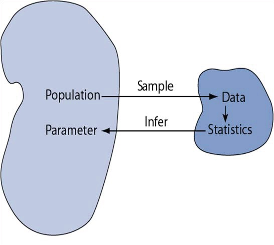
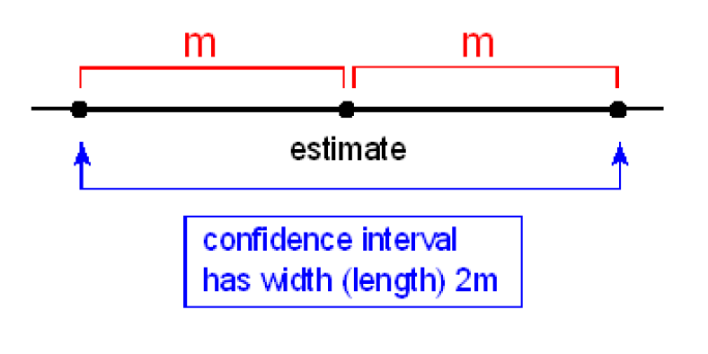
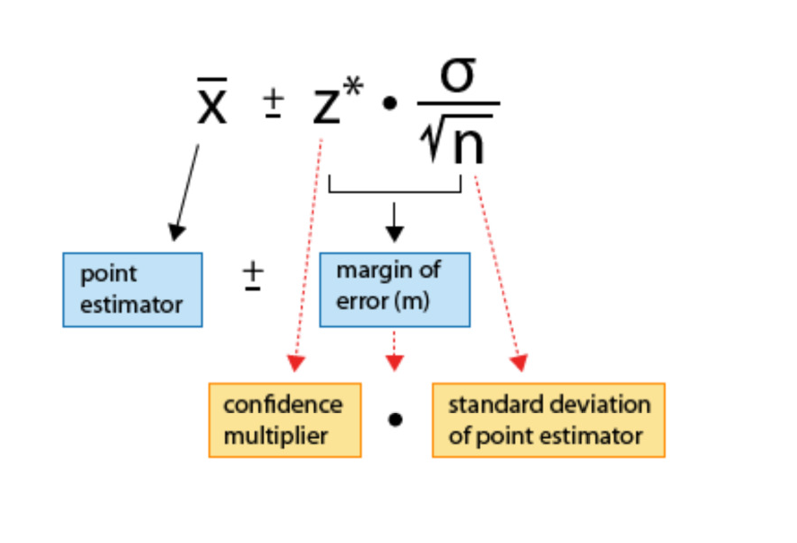
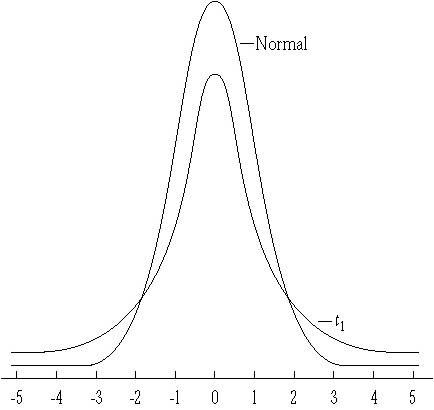

```{r, child="setup.Rmd", echo=FALSE}
```


## Main Ideas

- Understand the Central Limit Theorem (CLT) and how to use the result

- Create confidence intervals for the population mean using a CLT-based approach
  
- Create confidence intervals for the population proportion using a CLT-based approach
  
<div style="font-size:0.5em;">

Note: bootstrapping notes are based on Data Science in a Box!

</div>

## Packages

```{r}
#| label: packages

library(tidyverse)
library(infer)
```

## Central Limit Theorem

The *central limit theorem* says that for any distribution with a well-defined mean and variance, the distribution of *means* for a sample of size $n$ is approximately normal. This result has strong implications in many areas of statistics, including in construction of confidence intervals and in hypothesis testing.

## Population and Samples

:::: columns

::: {.column width="55%"}

- Statistical inference is the act of generalizing from a sample to a population with an estimated degree of uncertainty
- We want to know about *parameters* in a population
- We calculate *statistics* in our sample to learn about parameters

:::

::: {.column width="45%"}

```{r}
#| echo: false


```

:::

::::

## Parameters and Statistics 

It is imperative to understand the difference between statistics and parameters.

|   | **Parameters** | **Statistics** |
|:----|:------:|:------:|
| Source | Population | Sample |
| Calculated? | No | Yes |
| Example notation | $\mu, \sigma, \pi$ | $\overline{x}, s, p, \hat{\mu}, \hat{\sigma}, \hat{\pi}$ |

## Parameters and Statistics

:::: columns

::: {.column width="40%"}

```{r}
#| echo: false


```

:::

::: {.column width="60%"}

Still confused about parameters and statistics? Let's talk Plato instead. Plato presented his famous **Allegory of
the Cave** in *The Republic*. It may be
helpful think of parameters as Platonic
forms and the statistics we calculate as
the shadows on the wall of the cave.
Here is a short video clip describing this
allegory: [Allegory of the Cave
Claymation](https://www.youtube.com/watch?v=E4XXItJYFKA)

:::

::::

<div style="font-size:0.5em;">

A less (more?) depressing example is my portraiture.

</div>

## Sampling Distribution of the Mean

Suppose we have an infinitely large population and do the following.

1. Take a sample of size $n$ of variable $x$ and calculate its mean $\overline{x}_1=\sum_{i=1}^n x_i$
2. Take a second sample of the same size and calculate its mean $\overline{x}_2$
3. Repeat this many times to get a dataset of sample means $\overline{x}_1, \overline{x}_2, \ldots$

What is the distribution of the *statistics* $\overline{x}_1, \overline{x}_2, \overline{x}_3, \ldots$?


## Test case: Binomial data

During the Summer 2026 COVID wave, the CDC reported that 1.8% of the US population was actively infectious.  Define the variable $X$ to take value 1 if a randomly sampled person in the US is infectious, and let it be 0 otherwise.

- The random variable $X$ is Bernoulli. A Bernoulli random variable has mean $\pi$ and variance $\pi(1-\pi)$. Here $\pi=0.018$.
- If we take a random sample, the average $\overline{x}=\hat{\pi}$ is an *estimate* of this probability (it's just the fraction of 1's)
- If we take repeated samples and compute the proportion infectious in each, what values will we see?  Will we get 0.018 each time?

---

### Simulation: Infectious People

<div style="font-size:0.7em;">


Let's generate one thousand samples from a Binomial with $\pi$=0.018 and different values of $n$, the size of each sample. (Remember R's $n$, the number of simulated datasets, is different from our $n$, the number of samples in each dataset, also called the binomial $n$. Below we always simulate 1000 datasets, but the number of people in each ranges from 10 to 10000.)

</div>


```{r}
#| label: genbinom

binomdata = tibble(
  X=c(rbinom(n=1000,10,.018),
      rbinom(n=1000,100,.018),
      rbinom(n=1000,1000,.018),
      rbinom(n=1000,10000,.018)),
  N=c(rep(10,1000),rep(100,1000),
      rep(1000,1000),rep(10000,1000)),pihat=X/N)
```

<div style="font-size:0.7em;">

This code generates 1000 samples from a binomial $n=10$, $\pi=0.018$ distribution, 1000 samples from a binomial $n=100$, $\pi=0.018$ distribution, 1000 samples from a binomial $n=1000$, $\pi=0.018$ distribution, and 10000 samples from a binomial $n=10000$, $\pi=0.018$ distribution. The vector $X$ contains the count $x$ of infectious people in each sample, and the vector $N$ contains the sample size (so is 10 for the first 1000 entries, 100 for the second 1000, and so forth). We estimate $\pi$ as $\hat{\pi}=\frac{x}{n}$ in each sample.

</div>

## {background-color="white"}

:::: columns

::: {.column width="50%"}

```{r}
#| label: head

head(binomdata)
```

:::

::: {.column width="50%"}

```{r}
#| label: tail

tail(binomdata)
```

:::

::::

What do you notice about the quality of the estimates $\hat{\pi}$ and sample size $N$?

## {background-color="white"}


```{r}
#| fig-width: 12
#| fig-height: 6

binomdata %>%
ggplot(aes(x = pihat, fill = as.factor(N))) + 
  geom_density() +
  labs(x = "Mean Fraction Infectious",
      title = expression(paste("1000 Samples of Size N with ", pi, "=0.018")),
       fill = "Sample Size (N)")
```


<div style="font-size:0.7em;">

How does the variability of the sampling distribution depend on the size of our random samples over which the mean is calculated (the binomial "n")?

</div>

## Central Limit Theorem

The *Central Limit Theorem* says that for a population with mean $\mu$ and standard deviation $\sigma$, the important three properties of the distribution of sample averages $\bar{x}$ hold:
- The mean of the sampling distribution is identical to the population mean $\mu$.
- The standard deviation of the distribution of the sample averages is $\frac{\sigma}{\sqrt{n}}$, called the *standard error* of the mean.
- For $n$ large enough (in the limit as $n \rightarrow \infty$), the shape of the sampling distribution is approximately normal (Gaussian)

[See the CLT in Action!](http://demonstrations.wolfram.com/SamplingDistributionOfTheSampleMean/)

Note for our Bernoulli example, $\mu=\pi$ and $\sigma=\sqrt{\pi(1-\pi)}$

## How Large is Large Enough for $n$?

For binomial data, one rule of thumb is that you want the 
sample size $n$ to be large enough that $n \pi>10$ and $n(1- \pi)>10$.

So if $\pi$ is around a half, you need fewer samples than if $\pi$ is close to the boundaries of 0 or 1. 

What sample size would we want for our study of infected people?

## Wait, that variable was binomial!

The Central Limit Theorem tells us that the *sample averages* are normally distributed if we have enough data.  This result holds even if our original variables (here, we started with 0/1 indicators of infectiousness) are not normally distributed.

In statistics, there's generally more than one way to do things!  While the Central Limit Theorem gives us a great approximation, we'll also learn how to use an exact method to draw inferences for binary data later.

## Distribution of the sample mean


Knowing the distribution of the sample statistic $\bar{X}$ can help us

- estimate a population parameter as point estimate $\pm$ margin of error, where 
  the margin of error is comprised of a measure of how confident we want to be 
  and the sample statistic's variability.

- test for a population parameter by evaluating how likely it is to obtain the
  observed sample statistic when assuming that the null hypothesis is true, as 
  this probability will depend on the sampling distribution's variability.
  
## Normal Distribution

When necessary conditions are met, we can also use inference methods based on the 
CLT. Then the CLT tells us that $\bar{X}$ approximately has the distribution 
$N\left(\mu, \left(\sigma/\sqrt{n}\right)^2\right)$, where $\sigma$ is the standard deviation of the variable of interest. So for a Bernoulli distribution, $\sigma=\sqrt{\pi(1-\pi)}$. Then

$$Z = \frac{\bar{X} - \mu}{\sigma/\sqrt{n}} \sim N(0, 1)$$

## Lead in Flint, MI

From April 25, 2014 to October 15, 2015, the water supply source for Flint, MI was switched to the Flint River from the Detroit water system. Without corrosion inhibitors, the Flint River water, which is high in chloride, caused lead from aging pipes to leach into the water supply. We have data from Flint collected as part of a citizen-science project involving Virginia Tech researchers.

```{r}
#| echo: false
knitr::include_graphics("../img/flintdetroit.jpg")
```

## Forms of Statistical Inference

<div style="font-size:0.75em;">

- *Point estimation*: estimating an unknown parameter using a single number calculated from the sample data
  - Based on the ENDES sample survey of Peruvian children $<12$ years of age, 30% had accessed oral health services in the prior six months
- *Interval estimation*: estimating an unknown parameter using an interval or range of values that is likely to cover the true population value
  - We estimate 28-32% of children $<12$ years of age in Peru accessed oral health services in the prior six months
- *Hypothesis testing*: checking whether sample data provide evidence against some claim made about the population
  - We evaluated the hypothesis that family wealth
was unrelated to accessing dental health services in the prior 6 months in children $<12$ years old. In our sample the proportion of wealthy children receiving preventive dental services in this interval was roughly twice that of poor children, and testing whether these proportions differed by wealth provided evidence against the hypothesis.

</div>

## Flint 

The EPA action level for lead in public water supplies is 15 ppb. Suppose that the truth is that 20% of Flint homes have lead levels higher than this. If we collected water from a random sample of homes, we might not be surprised to find that 19% or 21% of our samples had lead levels over 15 ppb.  What if we found 22%?  25%?  30%?  We would like to have some understanding of the *margin of error* to get a good idea of the plausible range of values.

The idea behind *interval estimation* is to provide a plausible range of values, which can also be useful in the interpretation of a single point estimate.

## What is a Confidence Interval?

A confidence interval provides a range of reasonable values that are intended to contain the parameter of interest with a certain degree of confidence. It often takes the form

point estimate $\pm$ margin of error 

and is written

(point estimate - margin of error, point estimate + margin of error).

```{r}
#| echo: false
#| out.width: "45%"

```

## Moving towards confidence intervals

<div style="font-size:0.85em;">

From the Central Limit Theorem, $$Z = \frac{\bar{X} - \mu}{\sigma/\sqrt{n}} \sim N(0, 1)$$  or for the Bernoulli case, $$Z = \frac{\bar{X} - \pi}{\frac{\sqrt{\pi(1-\pi)}}{\sqrt{n}}} \sim N(0, 1)$$ 

Based on properties of the standard normal distribution, $$P(-1.96 < Z < 1.96)=0.95.$$

Let's substitute for $Z$ and rearrange the equation. 

</div>

## {background-color="white"}

$$P\left(-1.96 < \frac{\bar{X} - \pi}{\frac{\sigma}{\sqrt{n}}}<1.96\right)=0.95$$
$$P\left(-1.96\frac{\sigma}{\sqrt{n}}<\bar{X} - \pi<1.96\frac{\sigma}{\sqrt{n}}\right)=0.95$$

$$P\left(-1.96\frac{\sigma}{\sqrt{n}}-\bar{X}< - \pi<1.96\frac{\sigma}{\sqrt{n}}-\bar{X}\right)=0.95$$
 $$P\left(1.96\frac{\sigma}{\sqrt{n}}+\bar{X} \geq  \pi \geq -1.96\frac{\sigma}{\sqrt{n}}+\bar{X}\right)=0.95$$

$$P\left(\bar{X}-1.96\frac{\sigma}{\sqrt{n}} \leq  \pi \leq \bar{X} + 1.96\frac{\sigma}{\sqrt{n}}\right)=0.95$$

## {background-color="white"}

This gives us a *95% confidence interval* for $\pi$ of $\left(\bar{X}-1.96\frac{\sigma}{\sqrt{n}}, \bar{X}+1.96\frac{\sigma}{\sqrt{n}} \right)$.

<div style="font-size:0.8em;">

Be careful when interpreting this interval.

- If we select a number m of random samples from the
population and use them calculate m different confidence
intervals for $\pi$, then approximately 95% of the intervals would
cover the true population proportion $\pi$, and 5% would not.

- Sometimes people interpret the interval by saying that they are 95% confident that the interval covers the true proportion. 

- We don't know whether any one interval is in the 95% that
would cover the mean, or the 5% that would not. (Sorry. I
know that's what everyone wants. This is one reason Bayesian inference is nice!)

- WRONG: There is a 95% chance that $\pi$ lies in the confidence interval. $\pi$ is either in the interval, or it is not, and we don't know which. Again, sorry.

- [Seeing Theory](https://seeing-theory.brown.edu/frequentist-inference/index.html#section2) has a great interactive applet regarding confidence intervals.

</div>

## Confidence Intervals

```{r}
#| echo: false

```

## Confidence Level


<div style="font-size:0.8em;">

While 95% confidence intervals are the most common, it is simple to generate other intervals, for example 99% intervals. The only change is that you replace the z-score 1.96 (cuts off 2.5% in each tail) with the z-score that cuts off the appropriate amount (0.5% in each tail for a 99% interval). So the general formula is

$\left(\bar{X}-z_{\frac{\alpha}{2}}\frac{\sigma}{\sqrt{n}}, \bar{X}+z_{\frac{\alpha}{2}}\frac{\sigma}{\sqrt{n}} \right)$

for a $100(1-\alpha)$% confidence interval. Here the notation $z_{\frac{\alpha}{2}}$ indicates the z-score that cuts off the upper 100 $\times \frac{\alpha}{2}$% of the
distribution. So if $\alpha = 0.05$, you have a 95% interval using
$z_{\frac{\alpha}{2}} = 1.96$.

For a 99% interval, you need the z-score that cuts off the upper 0.005 of the distribution, which is 2.58.

</div>

## Confidence Intervals

We can use the interval for $\mu$ given by 
$\left(\bar{X}-z_{\frac{\alpha}{2}}\frac{\sigma}{\sqrt{n}}, \bar{X}+z_{\frac{\alpha}{2}}\frac{\sigma}{\sqrt{n}} \right)$ under the following conditions when $\sigma$ does not need to be estimated separately from $\mu$; this is the case for the Bernoulli distribution, where $\mu=\pi$ and $\sigma=\sqrt{\pi(1-\pi)}$.

- when our random variable $X$ is known to be normally distributed
- when $X$ may not be normally distributed, but when our sample size is large

We do not want to use this type of interval when our sample size is small and $X$ is not normal.

## Try it out: Flint Data

<div style="font-size:0.8em;">

Let's calculate the estimated proportion of homes in Flint with lead levels over 15 ppb along with a 95% confidence interval for the proportion.

```{r}
#| label: readflint
library(readxl)
library(glue)
flint=read_excel("../data/Flint-Samples.xlsx",sheet=1)
flint=rename(flint, "Pb_initial"="Pb Bottle 1 (ppb) - First Draw")
res.glue <- flint %>%
  mutate(Pbover15 = Pb_initial > 15) %>%
  summarize(propover15 = mean(Pbover15),
            n.lead = n()) %>%
  mutate(
    se.lead = sqrt(propover15 * (1 - propover15)) / sqrt(n.lead),
    lower.ci.lead = propover15 - qnorm(1 - (0.05 / 2)) * se.lead,
    upper.ci.lead = propover15 + qnorm(1 - (0.05 / 2)) * se.lead
  ) 
ci.glue=glue("({round(res.glue$lower.ci.lead,2)}, {round(res.glue$upper.ci.lead,2)})") 
```

In our sample, `r round(100*res.glue$propover15,0)`% of homes had lead levels over 15 ppb, with a 95% confidence interval for the proportion of homes with high lead of `r ci.glue`.

</div>

## Confidence Interval Width

$$\left(\bar{X}-z_{\frac{\alpha}{2}}\frac{\sigma}{\sqrt{n}}, \bar{X}+z_{\frac{\alpha}{2}}\frac{\sigma}{\sqrt{n}} \right)$$

For a given $z_{\frac{\alpha}{2}}$, confidence intervals that are more narrow indicate greater certainty in estimated values. As you can see from the formula, the way to get more narrow intervals is to increase $n$, the sample size.

This is logical -- we would expect to have greater certainty with more data of a given quality.

## Practice

In a recent study of 50 randomly selected statistics students, they
were asked the number of hours per week they spend on
their statistics classes. The results were used to estimate the mean
time for all statistics students with 90%, 95% and 99% confidence
intervals. These were (not necessarily in the same order):
$$(7.5, 8.5) ~~~ (7.6, 8.4) ~~~(7.7, 8.3).$$

Which interval is which?

## One-sided versus two-sided intervals

Sometimes, but not often, we want only an upper limit or a lower
limit for the population mean. These are call one-sided intervals.  A standard confidence interval is two-sided.

One example of this would be in a non-inferiority clinical trial for a generic version of a popular pharmaceutical product (we don't expect the generic drug to work better, but we do expect it to be just as good or at least very close). One-sided intervals are constructed only on one side and use $z_\alpha$ instead of $z_{\frac{\alpha}{2}}$, which makes them more narrow on the side of interest. They should be used with great caution and only in situations in which they are clearly warranted (i.e., seek guidance of a statistician first!).

## Sigma Unknown

The interval $$\left(\bar{X}-z_{\frac{\alpha}{2}}\frac{\sigma}{\sqrt{n}}, \bar{X}+z_{\frac{\alpha}{2}}\frac{\sigma}{\sqrt{n}} \right)$$ requires an estimate of $\sigma$. In the Bernoulli case, we only estimate one parameter $\pi$, which then gives us both the mean $\mu=\pi$ and $\sigma=\sqrt{\pi(1-\pi)}$. In the normal case, we need to use the data to get a separate estimate of $\sigma$.

If you have taken statistics before, you may remember using $s=\frac{1}{n-1}\sum_{i=1}^n(x_i-\overline{x})^2$, the sample standard deviation, to estimate $\sigma$. This is generally a good estimate!  

HOWEVER...

## Sigma Unknown

If we estimate $\sigma$ using $s$, then 

- we can't use the central limit theorem the same way

- and if $X$ is not exactly normal, we can't use $z$-scores

Most of the time, we don't know $\sigma$ and need to estimate it!

## What do you do when $\sigma$ is unknown, anyway?


```{r}
#| echo: false
#| out.width: "30%"

```


## No, seriously!

:::: columns

::: {.column width="75%"}

<div style="font-size:0.8em;">

While working for Guinness
Brewery in Dublin, William Sealy
Gosset published a paper on the
t distribution, which became
known as Student's t distribution
(he published under "Student"
because the brewery didn't allow
him to use his own name).

- He used the new distribution
to determine how large a
sample of persons to use in
taste-testing beer! Guinness worried competitors would steal their secret if he published under his own name.

- The t distribution is
appropriate for constructing
a confidence interval for the
mean when we need to
account for the additional
variability due to estimating $\sigma$ in addition to $\mu$

- Student. (1908). The probable error of a mean. *Biometrika*, *6*(1), 1–25. [https://doi.org/10.1093/biomet/6.1.1](https://doi.org/10.1093/biomet/6.1.1)


</div>

:::

::: {.column width="5%"}

:::

::: {.column width="20%"}

```{r}
#| echo: false


```


<div style="font-size:0.5em;">

For those who like coincidences, this paper was published in March. Interestingly, in Ireland, March 17th, St. Patrick's Day, was a strictly enforced, dry religious holiday for which all pubs were legally mandated to be closed until the 1960s and 1970s.

</div>

:::

::::


## Student's t distribution


:::: columns

::: {.column width="50%"}

<div style="font-size:0.8em;">

The t distribution looks a lot like
the normal except that it has fatter
tails

- The fatter tails lead to wider
confidence intervals, which
acknowledge our extra uncertainty
because we had to estimate $\sigma$
instead of using its true value

- As the sample size gets bigger, the
t distribution looks more and more
like the normal distribution, and t-scores and z-scores become quite similar

</div>

:::

::: {.column width="50%"}

```{r}
#| echo: false

```

:::

::::

## Student's t distribution

<div style="font-size:0.9em;">

The t distribution has a property called *degrees of freedom*,
abbreviated *df*. The degrees of freedom measure the amount of
information available in the data to estimate $\sigma$ and thus give us information about how reliable our estimate $s$ is. The random
variable $$t=\frac{\bar{X}-\mu}{\frac{s}{\sqrt{n}}}$$
has a Student's t distribution with n-1 degrees of freedom,
represented using the notation $t_{n-1}$. The df are $n-1$ instead of the sample size $n$ because we lose 1 df by estimating the sample mean with $\bar{x}$. 

For each possible df, there is a different t distribution, with the t distribution looking more like the normal as $n$ gets large and $s$ gets to be a better and better estimate of $\sigma$.

</div>

## Calculating a Confidence Interval for Flint Lead

Now we calculate a 95% confidence interval for the mean lead levels in Flint water. Because we need to estimate the standard deviation, we'll use a t-based confidence interval.

```{r flintmeanci}
res.glue.2 <- flint %>%
  summarize(meanPb = mean(Pb_initial),
            var.lead = var(Pb_initial),
            n.lead = n()) %>%
  mutate(
    se.lead = sqrt(var.lead/n.lead),
    lower.ci.lead = meanPb - qt(1 - (0.05 / 2),n.lead-1) * se.lead,
    upper.ci.lead = meanPb + qt(1 - (0.05 / 2),n.lead-1) * se.lead
  ) 
ci.glue.2=glue("({round(res.glue.2$lower.ci.lead,2)}, {round(res.glue.2$upper.ci.lead,2)})") 
```

In our sample, the estimated mean lead level in initial water samples was `r round(res.glue.2$meanPb,2)` ppb, with a 95% confidence interval for the mean of  `r ci.glue.2`.


## Confidence Interval with $\sigma$ Unknown

When $\sigma$ is unknown, we use the interval


$$\left(\bar{X}-t_{n-1,\frac{\alpha}{2}}\frac{s}{\sqrt{n}}, \bar{X}+t_{n-1,\frac{\alpha}{2}}\frac{s}{\sqrt{n}} \right)$$ 


## Calculating a Confidence Interval for Flint Lead

<div style="font-size:0.8em;">

Now we calculate a 95% confidence interval for the mean lead levels in Flint water. Because we need to estimate the standard deviation, we'll use a t-based confidence interval.

```{r}
#| label: flintmeancit
res.glue.2 <- flint %>%
  summarize(meanPb = mean(Pb_initial),
            var.lead = var(Pb_initial),
            n.lead = n()) %>%
  mutate(
    se.lead = sqrt(var.lead/n.lead),
    lower.ci.lead = meanPb - qt(1 - (0.05 / 2),n.lead-1) * se.lead,
    upper.ci.lead = meanPb + qt(1 - (0.05 / 2),n.lead-1) * se.lead
  ) 
ci.glue.2=glue("({round(res.glue.2$lower.ci.lead,2)}, {round(res.glue.2$upper.ci.lead,2)})") 
```

In our sample, the estimated mean lead level in initial water samples was `r round(res.glue.2$meanPb,2)` ppb, with a 95% confidence interval for the mean of  `r ci.glue.2`.

</div>

## Seriously?

Ok, that was a lot of work. There's a quick way to get it too.

```{r}
#| label: ttest
t.test(flint$Pb_initial)
```

We'll learn more about the t test soon.

## Bootstrapping

Bootstrapping is a simple, intuitive statistical procedure that can
be used to obtain estimates of standard errors or confidence
intervals. For example, consider a 95% confidence interval for the
median. The distribution of the sample median is complex and
does not allow simple calculation of the 95% CI.
The idea behind the bootstrap is to take repeated samples, with
replacement, from our sample, and use those to approximate the
distribution of quantities of interest in the sample.

## Bootstrapped Confidence Interval

<div style="font-size:0.7em;">

Calculating a bootstrapped confidence interval is quick and easy using R.  The basic scheme is as follows.

1. Take a bootstrap sample - a random sample taken with replacement from the original sample, of the same size as the original sample
2. Calculate the bootstrap statistic - a statistic such as mean, median, proportion, slope, etc. computed on the bootstrap samples
3. Repeat steps (1) and (2) many times to create a bootstrap distribution - a distribution of bootstrap statistics
4. Calculate the bounds of the XX% confidence interval as the middle XX% of the bootstrap distribution 

</div>

<div style="font-size:0.5em;">

Note about sampling:

Suppose I have a hat that contains 20 marbles, 19 of which are blue, and one of which is silver. If you draw the silver marble, you win a $100 gift certificate to Student Stores. If you draw a blue marble, you win a Duke sticker.

Sampling with replacement: everyone draws from a hat containing all 20 marbles, and I need to be sure I can cover the cost of everyone drawing a silver marble, in the unlikely event this occurs.

Sampling without replacement: once a marble is drawn, it is not returned to the hat. If the first person draws the silver marble, the rest of you are out of luck. I just need $100 for the demonstration.

</div>


## Generate bootstrap means

```{r eval=FALSE}
library(tidymodels)
flint %>%
  # specify the variable of interest
  specify(response = Pb_initial)
```

## Generate bootstrap means

```{r}
#| eval: false
flint %>%
  # specify the variable of interest
  specify(response = Pb_initial)
  # generate 15000 bootstrap samples
  generate(reps = 15000, type = "bootstrap")
```

## Generate bootstrap means

```{r}
#| eval: false
flint %>%
  # specify the variable of interest
  specify(response = Pb_initial)
  # generate 15000 bootstrap samples
  generate(reps = 15000, type = "bootstrap")
  # calculate the mean of each bootstrap sample
  calculate(stat = "mean")
```

## Generate bootstrap means

```{r include=FALSE}
set.seed(1213)
```

```{r}
# save resulting bootstrap distribution
boot_flintmean <- flint %>%
  # specify the variable of interest
  specify(response = Pb_initial) %>%
  # generate 15000 bootstrap samples
  generate(reps = 15000, type = "bootstrap") %>%
  # calculate the mean of each bootstrap sample
  calculate(stat = "mean")
```

## The bootstrap sample

::: {.question}
How many observations are there in `boot_flintmean`? What does each observation represent?
:::

```{r}
boot_flintmean
```

## Visualize the bootstrap distribution

```{r}
ggplot(data = boot_flintmean, mapping = aes(x = stat)) +
  geom_histogram() +
  labs(title = "Bootstrap distribution of means",
       x = "Means of Each Bootstrap Sample")
```

## Calculate the confidence interval

A 95% confidence interval is bounded by the middle 95% of the bootstrap distribution.

```{r}
boot_flintmean %>%
  summarize(lower = quantile(stat, 0.025),
            upper = quantile(stat, 0.975))
```

## Visualize the confidence interval

```{r}
#| include: false 
# for using these values later
lower_bound <- boot_flintmean %>% summarize(lower_bound = quantile(stat, 0.025)) %>% pull() 
upper_bound <- boot_flintmean %>% summarize(upper_bound = quantile(stat, 0.975)) %>% pull() 
```

```{r}
#| echo: false
#| out.width: "70%"
ggplot(data = boot_flintmean, mapping = aes(x = stat)) +
  geom_histogram() +
  geom_vline(xintercept = c(lower_bound, upper_bound), color = "#A7D5E8", size = 2) +
  labs(title = "Bootstrap distribution of means",
       subtitle = "and 95% confidence interval",
       x = "Means of Each Bootstrap Sample")
```


## Interpret the confidence interval

::: {.question}

The 95% confidence interval for the mean lead levels of initial water samples from Flint is (`r round(lower_bound,1)`, `r round(upper_bound,1)`). Which of the following is the correct interpretation of this interval?

**(a)** 95% of the time the mean lead level in this sample is between `r round(lower_bound,1)` and `r round(upper_bound,1)` ppb.

**(b)** 95% of all water samples in Flint have lead levels between `r round(lower_bound,1)` and `r round(upper_bound,1)` ppb.

**(c)** We are 95% confident that the mean lead level in Flint is between `r round(lower_bound,1)` and `r round(upper_bound,1)` ppb.

**(d)** We are 95% confident that the mean lead level in this sample is between `r round(lower_bound,1)` and `r round(upper_bound,1)` ppb.


:::

# Accuracy vs Precision

## Confidence level

**We are 95% confident that ...**

- Suppose we took many samples from the original population and built a 95% confidence interval based on each sample.

- Then about 95% of those intervals would contain the true population parameter.

## Commonly used confidence levels

::: {.question}

Which lines represent which confidence levels? Options: 90%, 95%, 99%.

:::

```{r}
#| echo: false

l90 <- boot_flintmean %>% summarize(lower_bound = quantile(stat, 0.05)) %>% round(2) %>% pull()
u90 <- boot_flintmean %>% summarize(lower_bound = quantile(stat, 0.95)) %>% round(2) %>% pull()

l99 <- boot_flintmean %>% summarize(lower_bound = quantile(stat, 0.005)) %>% round(2) %>% pull()
u99 <- boot_flintmean %>% summarize(lower_bound = quantile(stat, 0.995)) %>% round(2) %>% pull()

ggplot(data = boot_flintmean, mapping = aes(x = stat)) +
  geom_histogram() +
  geom_vline(xintercept = c(lower_bound, upper_bound), color = "#C6236C", lty = 2, size = 2) +
  geom_vline(xintercept = c(l90, u90), color = "#C6D64A", lty = 3, size = 2) +
  geom_vline(xintercept = c(l99, u99), color = "#D29380", lty = 6, size = 2) +
  labs(title = "Bootstrap distribution of means",
       subtitle = "and various confidence intervals",
       x = "Means")
```

## Precision vs. accuracy

::: {.question}
If we want to be very certain that we capture the population parameter, should we use a wider or a narrower interval? What drawbacks are associated with using a wider interval?
:::

## {background-color="white"}

```{r}
#| echo: false
#| out.width: "60%"


```

<div style="font-size:0.5em;">

Garfield, Paws, Inc. 

</div>


## {background-color="white"}

::: {.question}
How can we get best of both worlds -- high precision and high accuracy?
:::

## Changing confidence level

::: {.question}

How would you modify the following code to calculate a 90% confidence interval? 
How would you modify it for a 99% confidence interval?

:::

```{r}
#| eval: false
flint %>%
  specify(response = Pb_initial)
  generate(reps = 15000, type = "bootstrap")
  # calculate the mean of each bootstrap sample
  calculate(stat = "mean") %>%
  summarize(lower = quantile(stat, 0.025),
            upper = quantile(stat, 0.975))
```

## Now Let's Get CI for the Median

Recall the median is the middle value in a dataset.

```{r}
#| label: bootmed
boot_flintmedian <- flint %>%
  # specify the variable of interest
  specify(response = Pb_initial) %>%
  # generate 15000 bootstrap samples
  generate(reps = 15000, type = "bootstrap") %>%
  # calculate the mean of each bootstrap sample
  calculate(stat = "median")
```

## {background-color="white"}

```{r}
#| label: medianviz
ggplot(data = boot_flintmedian, mapping = aes(x = stat)) +
  geom_histogram() +
  labs(title = "Bootstrap distribution of medians",
       x = "Medians of Each Bootstrap Sample")

```

## {background-color="white"}

```{r}
#| label: calcbounds
boot_flintmedian %>%
  summarize(lower = quantile(stat, 0.025),
            upper = quantile(stat, 0.975))
```


## {background-color="white"}

```{r}
#| label: finalize
lower_bound <-
  boot_flintmedian %>% summarize(lower_bound = quantile(stat, 0.025)) %>% pull() %>% round()
upper_bound <-
  boot_flintmedian %>% summarize(upper_bound = quantile(stat, 0.975)) %>% pull() %>% round()
```

## {background-color="white"}

```{r}
#| label: plotmed
ggplot(data = boot_flintmedian, mapping = aes(x = stat)) +
  geom_histogram() +
  geom_vline(xintercept = c(lower_bound, upper_bound), color = "#A7D5E8", size = 2) +
  labs(title = "Bootstrap distribution of medians",
       subtitle = "and 95% confidence interval",
       x = "Medians of Each Bootstrap Sample")

```

## Mean $>>$ Median

Wow, those medians are so much smaller than the means! Perhaps we should have started with a little visualization of the raw data.

```{r}
#| label: vizdata
#| out.width: "50%"
flint %>%
  ggplot(aes(x = Pb_initial)) +
  geom_histogram() +
  labs(title = "Initial Pb Levels")

```

Ahh, this distribution is highly skewed. Which value is a better measure of the center of the distribution?

## Recap

- Sample statistic $\ne$ population parameter, but if the sample is good, it can be a good estimate

- We report the estimate with a confidence interval, and the width of this interval depends on the variability of sample statistics from different samples from the population

- Since we can't continue sampling from the population, we bootstrap from the one sample we have to estimate sampling variability

- We can do this for any sample statistic:
  - For a mean: `calculate(stat = "mean")`
  - For a median: `calculate(stat = "median")`
  
  
## Homework (Practice)

[**IMS Chapter 13**](https://openintrostat.github.io/ims/foundations-mathematical.html#sec-chp13-exercises)

- Problem 1
- Problem 14
- Problem 15

[**IMS Chapter 19**](https://openintrostat.github.io/ims/inference-one-mean.html#sec-chp19-exercises)

- Problem 1
- Problem 3
- Problem 13


