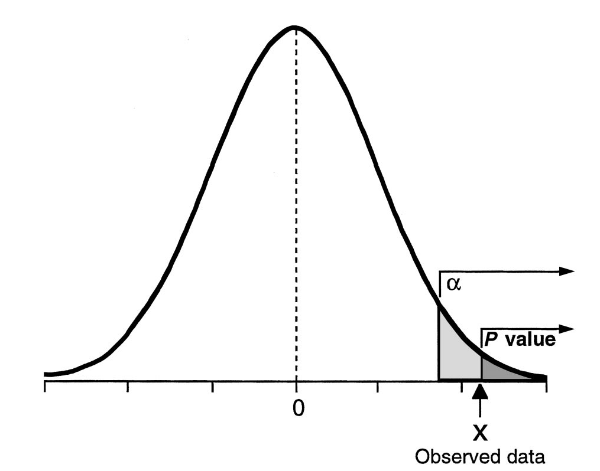

```{r, child="setup.Rmd", echo=FALSE}
```


```{r}
#| label: global_options
#| include: false
knitr::opts_chunk$set(echo = TRUE, message = FALSE, warning = FALSE,
                      comment = "#>", highlight = TRUE,
                      fig.align = "center")

```

## Main ideas

- Understand Null Hypothesis Significance Testing Framework

- Understand use and misuse of p-values

- Learn about testing errors and how to minimize their probability

## Packages

```{r packages}
library(tidyverse)
library(infer)
library(readxl)
```

## Example: Honor Court

Suppose a case of suspected cheating is brought to a university Honor Court.  There are two opposing claims.

**Student:**  I did not cheat on the exam.

**Professor:**  The student did cheat on the exam.

This Honor Court assumes students are innocent until proven guilty.  The professor must provide evidence to support their claim. They explain that they had two different versions of the exam and that the student on three separate problems used numbers from the *other* version of the exam.  (oops)

## Example: Honor Court

The honor court members agree that this would be *extremely unlikely* if it were true that the student did not cheat.  They agree that the professor's evidence is very strong and conclude that the student did cheat on the exam.  

## Hypothesis Testing Framework


Steps in hypothesis testing:

- Start with two claims about the population (often about the value of a population parameter or about some potential association between two variables in the population).  Call them claim 1 and claim 2.

- Choose a sampling strategy, draft an analysis plan, collect data, and summarize data

- Figure out how likely it is to see data like what we got, if claim 1 is true.

- If our data would have been unlikely if claim 1 were true, then we reject claim 1 and deem claim 2 worthy of further study.  Otherwise, we cannot reject claim 1.

## Example: Ultra Low Dose Contraceptives

A certain ultra-low dose oral contraceptive pill is supposed to contain 0.02 mg of estrogen. If the dose is higher, the user may risk side effects better avoided, and if the dose is lower, the user may get pregnant.  The manufacturer wishes to check whether the mean concentration in a large shipment is the needed 0.02 mg or not.  A random sample of $n=50$ pills is tested, and the sample mean concentration is 0.017 mg with a sample standard deviation of 0.008 mg.

Let's go through the hypothesis testing paradigm.

## {background-color="white"}

::: {.step-box style="background-color: #D3B4C1; border-left: 5px solid #A6617B;"}

**1. State the claims**

- **Claim 1**: The shipment is consistent with a population mean of 0.02 mg estrogen. $H_0: \mu=0.02$

- **Claim 2**: The shipment is not consistent with a population mean of 0.02 mg estrogen. $H_A: \mu \neq 0.02$

:::

::: {.step-box style="background-color: #8FADA2; border-left: 5px solid #1E5B45;"}

**2. Choose sampling strategy, design analysis plan, collect, and analyze data**

- Plan is to sample 50 pills at random and use a one-sample t-test to evaluate whether they are consistent with a population with mean 0.02 mg estrogen

- 50 pills were sampled with a sample mean $\bar{x}=0.017$ and sample standard deviation $s=0.008$

:::

## {background-color="white"}

::: {.step-box style="background-color: #DEA99C; border-left: 5px solid #BD5338;"}

3. Assess likelihood of our data, or more extreme results, if Claim 1 is true
  - We'll learn how to do this shortly, but for now assume the probability of getting a result like ours (or even more extreme) is just 0.01 if Claim 1 is true.
  
:::

::: {.step-box style="background-color: #95AEBF; border-left: 5px solid #2B547E;"}
  
4. Conclusion:  that's pretty unlikely.  We'll reject Claim 1 and assume this warrants further investigation -- the manufacturing procedure may not be consistent with one that produces pills at the required 0.02 mg dose, and further evaluation is needed to verify the dosage is sufficient to prevent breakthrough pregnancies.

:::

## {background-color="white"}


Now, suppose the probability was relatively large, say 0.50 instead of 0.01.  In this case, we would *fail to reject* Claim 1 and state that we do not have evidence to disprove Claim 1.  We would not say that evidence leads us to accept Claim 1, though.  This is a subtle but important difference. We assumed claim 1 was true before we did our calculation, and thus we calculated a probability about data like ours or more extreme than ours under that assumption (and not a probability of whether claim 1 was true directly).

:::: columns

::: {.column width="70%"}

```{r}
#| echo: false

```

:::

::: {.column width="30%"}


<div style="font-size:0.7em;">

The concept is the same as that in the US judicial system -- we might find someone "not guilty," but we would not proclaim them "innocent."

</div>

:::

::::

## Hypothesis Testing Steps (Again!)

1. State Claim 1 and Claim 2.  Claim 1 states "nothing unusual is happening" and Claim 2 challenges it.

2. Finalize data collection and analysis plans, collect relevant data, and summarize it.

3. Assess how surprising it would be to see data like that, or even more extreme data, *if Claim 1 is really true*.

4. Draw conclusions.

## Details: Step 1

Step 1 is to state Claim 1 and Claim 2.

- Claim 1 is called the *null hypothesis* or $H_0$.  It states that there is no change from the status quo or no relationship.

- Claim 2 is called the *alternative hypothesis* or $H_A$.  It states that there is something going on or some relationship.  Usually, $H_A$ is what we want to check or what we really think may be going on.

## Example: Ultra Low Dose Contraception

Step 1 is to state Claim 1 and Claim 2.

- $H_0$:  The pills are consistent with a population that has mean 0.02 mg estrogen.

- $H_A$:  The pills are not consistent with a population that has mean 0.02 mg estrogen.

## Practice with Step 1

What are $H_0$ and $H_A$ in each case?

1. Researchers would like to know whether a new intervention for informing children in developing countries of their HIV status is associated with different mental health quality of life. 

2. Researchers would like to know if lead levels in the water from Flint exceed the EPA action level of 15 ppb.

3. The WHO would like to know if the number of Bundibugyo cases in northeastern DRC and Kampala, Uganda, this week is the same as that from last week.

## Details: Step 2

Step 2 is to make a plan for data collection and analysis, take a sample, and summarize the data.  We will return to this topic, but the choice of summary statistic will depend on the type of data (e.g., categorical or continuous) as well as the distribution of the data. 

## Details: Step 3


Step 3 involves assessing the evidence in our data by calculating the probability of getting data like ours, or more extreme than ours, if $H_0$ is actually true.  This **conditional probability** will be based on our data summary statistic from Step 2.  This conditional probability is often called a *p-value*.

Technically, the probability of getting "data like ours, or more extreme than ours" is the probability of getting a specific test statistic based on the data, or one more extreme.  (That is, the same data can yield multiple p-values or confidence intervals depending on which test is used.)

## P-Value

Note that the p-value is a conditional probability, the probability of getting data like ours or more extreme data given that $H_0$ is true, and it conditions on our null hypothesis being true.  It does not provide direct information on the probability that $H_0$ is true given our data.

# P-Values

## P-value Defined

The *p-value* is the conditional probability, under the assumption of no effect or no difference, $H_0$, of obtaining a result equal to or more extreme than what was actually observed.

## Incorrect P-Value Interpretations

Many researchers think a p-value of 0.05 means the null hypothesis has a probability of only 5%.  This is wrong!

## Incorrect P-Value Interpretations

Many researchers will see $p=0.05$ and state that there is a 95% or greater chance that the null hypothesis is incorrect.  This is wrong!

A p-value is calculated *assuming* that $H_0$ is true.  It cannot be used to tell us how likely it is that assumption is correct.

## Hypothesis Testing Paradigm

The paradigm of hypothesis testing tries to limit the overall number of incorrect decisions over the long run.  While we of course want to know if any one study is showing us something real, or a type I or type II error (more on those shortly!), the paradigm does not give us the tools to determine this.

## What DO You Do with a P-value, Then?

Ideally, you evaluate a p-value in light of other information, such as a proposed biological mechanism, supporting evidence in the literature, size and quality of the study, and size of the purported effect.

In addition, when you interpret a p-value, be sure you are aware of other important factors that can inflate the false positive rate, e.g. multiple tests, "hidden" multiple tests (e.g., testing most appropriate form of covariate or for an interaction or other model selection procedures), changes to sample size, etc.


## I'm Nervous about P-values.  What Alternatives are There?

<div style="font-size:0.85em;">


- Many researchers prefer confidence intervals, which better represent the range of effects that are "compatible with the data"

- They are sometimes used as a hypothesis test (i.e., reporting results as significant when confidence interval does not include null value) and share many of the properties of p-values we have discussed

- Like p-values, confidence intervals do not offer a mechanism to unite external evidence with that provided by the study at hand

- *Bayesian methods* can be used to incorporate current study results with prior knowledge in order to provide a probability a hypothesis is true conditional on the current data (Bayes' theorem can get us what we want to know!)

</div>

## Correspondence between Hypothesis Tests and Confidence Intervals

We can examine a confidence interval to decide whether a proposed value for the population mean is reasonable.

Suppose we are testing $H_0:  \mu=0.02$ versus $H_A:  \mu \neq 0.02$ using a significance level of $\alpha=0.05$.   An alternative way to do this is to construct a 95% confidence interval for $\mu$ and use the following decision rule.

- If $0.02$ falls outside the confidence interval, reject $H_0$

- If $0.02$ falls inside the confidence interval, do not reject $H_0$

We may not want to make a binary decision but instead present a confidence interval and provide discussion. 

## "Sidedness" of tests

Typically, hypothesis tests are *two-sided*, meaning that we are looking for any difference from a hypothesized value, whether smaller or larger.  Sometimes, it is appropriate to conduct a *one-sided* test. For example, in the Flint data, we may only be concerned if lead levels in the Flint water are higher than the EPA action level. 

One-sided tests are extremely rare, and even in the Flint case it would be typical to see two-sided tests and confidence intervals presented.

## {background-color="white"}


Illustration of p-value from one-sided hypothesis test

```{r}
#| echo: false
#| out.width: "50%"

```


For a two-sided test, the p-value is doubled, but $\alpha$ is unchanged.

## Details: Step 4

Step 4 is drawing conclusions based on our test results.  Generally, we reject Claim 1 when the likelihood of seeing our data (or more extreme data) when Claim 1 is true would be relatively small.  Often, we consider a cutpoint (also called a significance level or $\alpha$ level) of $\alpha=0.05$ as defining the p-value as "small."  Using 0.05 as a cutpoint means that when the null hypothesis is true, we would expect to make the wrong decision only 5% of the time.   When the p-value $<\alpha$ you often see results described as "statistically significant."


When the p-value is $> \alpha$ then we say we have insufficient evidence to reject Claim 1.  Sometimes people interpret p-values in the rough range of $(\alpha, 2\alpha)$ as marginally significant (so for $\alpha=0.05$ that range would be $0.05-0.10$), but this is not recommended.


## {background-color="white"}

Common sense should also be used in drawing conclusions.  For example, if there is a very strong body of evidence in favor of the alternative hypothesis and you see $p=0.06$, you wouldn't necessarily use your results to refute all the prior work in an area.  This is one reason confidence intervals are often used in place of hypothesis tests.

## Example: Workplace Equity

An employer subscribes to an "equal opportunity" policy, stating it hires employees with children and employees without children equally often in managerial positions.  Suppose the current hiring pool is half applicants with children and half applicants without children, with both groups equally well-qualified.  The data you have are the last three hires, all of which were applicants without children.  How do you carry out a hypothesis test?

## Trial by Jury Analogy

:::: columns

::: {.column width="50%"}

```{r}
#| echo: false

```

:::

::: {.column width="50%"}

<div style="font-size:0.7em;">


A cat is on trial. Did it commit the crime? Evidence is presented as part of the trial by jury.

|  | Truly Innocent | Truly Guilty |
|:------|:------:|:---------:|
| Jury: Not Guilty | $\checkmark$ |  |
| Jury: Guilty |  | $\checkmark$ |

</div>

:::

::::

## {background-color="white"}

:::: columns

::: {.column width="50%"}

During the trial, we assume the cat is innocent unless it is proven guilty.  The right decisions are finding an innocent feline "not guilty" and convicting a guilty cat.   We could make two mistakes:  we could wrongly convict an innocent kitty, or we could declare a guilty cat "not guilty."

:::

::: {.column width="50%"}

```{r}
#| echo: false

```

:::

::::


## {background-color="white"}

<div style="font-size:0.8em;">

Let's translate into a hypothesis testing framework.  Suppose we wish to test that the population mean equals some value, say $\mu_0$.

Test of $H_0:  \mu=\mu_0$


|  | Truly $\mu=\mu_0$   | Truly $\mu\neq\mu_0$ |
|:------|:------:|:---------:|
| Decision: Do Not Reject $H_0$ | $\checkmark$ |   |
| Decision: Reject $H_0$ |    | $\checkmark$ | 

</div>

<hr>


<div style="font-size:0.8em;">

Type I error:  rejecting $H_0$ when it is really true


Type II error:  not rejecting $H_0$ when it is false


Notice these are also conditional probabilities and can be linked to the false positive and false negative rates of our test procedure if we think of it as a screening test.

</div>


## Possible Errors

<div style="font-size:0.8em;">

No test is perfect! Here are some potential errors we could make using this paradigm, also called the *Null Hypothesis Significance Testing (NHST)* paradigm.


- $\alpha$ is the probability of making a Type I error.  These errors, which involve incorrectly changing the status quo, are typically viewed as more severe than Type II errors.  The most common value is $\alpha=0.05$, though typically smaller values are used when multiple tests are being carried out.  We specify $\alpha$ at the design stage of the study and use it in making decisions with hypothesis tests.

- The probability of making a Type II error is $\beta$, which is related to the *power* of the test, given by $1-\beta$.  $\beta$ can also vary but is typically larger, say 0.20 (80% power) or 0.10 (90% power)
- The *power* of the test is the probability of rejecting $H_0$ when $H_0$ is indeed false.  We specify the power when we design a study and determine the sample size needed, but this value is not typically needed for another purpose after the sample is drawn.

</div>

## Type I Errors in Action

Circle, circle, dot, dot...we'll conduct our own study of one of the US's most widely-administered childhood  vaccinations.

## Back to Example: Workplace Equity

An employer subscribes to an "equal opportunity" policy, stating it hires employees with children and employees without children equally often in managerial positions.  Suppose the current hiring pool is half applicants with children and half applicants without children, with both groups equally well-qualified.  The data you have are the last three hires, all of which were applicants without children.  How do you carry out a hypothesis test?

If the null hypothesis is true, what was the probability of seeing these data, or data even more extreme?

