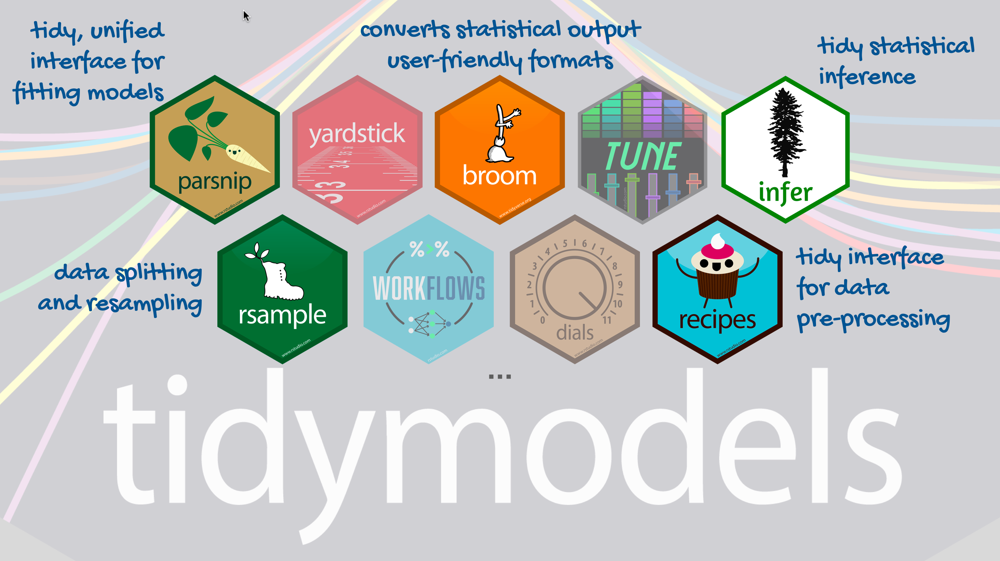

```{r, child="setup.Rmd", echo=FALSE}
```


```{r}
#| label: global_options
#| include: false
knitr::opts_chunk$set(echo = TRUE, message = FALSE, warning = FALSE,
                      comment = "#>", highlight = TRUE,
                      fig.align = "center")
library(ggtext)
library(knitr)
library(kableExtra)

```


# Models with numeric explanatory variables

## Mercury and Assets

Are mercury concentrations in hair related to household socioeconomic position, as measured by assets?

```{r}
#| label: prep
library(tidyverse)
library(tidymodels)
library(readr)
mercury <- readr::read_csv("../data/mercury_reg.csv")
mercury <-
  mercury %>%
  # scale() subtracts the mean and divides by the SD to make the units "standard deviations" like a z-score
  mutate(assets_sc=scale(SESassets)) %>%
  #another variable we may use later
  mutate(form_min_sc=scale(FM_buffer)) %>%
  #so I don't have to remember coding
  mutate(sex,sex_cat=ifelse(sex==1,"Male","Female")) %>%
  mutate(native,native_cat=ifelse(native==1,"Native","Non-native")) %>%
  mutate(hairHg=exp(lhairHg))
```


## Goal: Predict mercury from assets

$$\widehat{y}_{i} = \widehat{\beta}_0 + \widehat{\beta}_1 \times x_{i}$$
Here $y_i$ represents log hair mercury for subject $i$, and $x_i$ represents standardized household assets.


```{r}
#| label: hg_asset_plot
#| echo: false
#| warning: false
ggplot(data = mercury, aes(x = assets_sc, y = lhairHg)) +
  geom_point() +
  geom_smooth(method = "lm", se = FALSE, color = "#8E2C90") + 
  labs(
    title = "Hair mercury as a function of assets",
    subtitle = "Peruvian Amazon",
    x = "Household assets (standardized)",
    y = "Hair Mercury (log ppm)"
  )
```

## How did we know to transform using the log?

<div style="font-size:0.7em;">

In the previous notes, we saw that the distribution of Hg in hair had a strong right skew.


```{r}
# lhairHg is the natural log of mercury in hair
# this code puts it back on the ppm scale
ggplot(data = mercury, aes(x = exp(lhairHg))) +
  geom_histogram() +
  labs(x = "Mercury (ppm)", y = NULL)

```

</div>

## Assumptions of the Regression Model

The linear model actually does not require hair mercury itself to be approximately normal. Instead, it needs for the distribution of $y\mid x$, the conditional distribution of hair mercury given all the predictor variables, to be aproximately normal. This is the same as saying that the errors in the model are approximately normally distributed.

It's pretty easy to use a histogram to check the distribution of $y$, but how about the distribution of $y \mid x$?  That's not terribly complicated once you know how to fit a regression model, and we will work through an example of how to check it in the modeling process.

## Are household assets related to hair mercury?

- **Response:** hair mercury concentration, in ppm ($y_i$), contained in the variable `hairHg`
- **Explanatory variable:** a household assets score ($x_i$), contained in the variable `assets_sc`
  - A value of **0** on `assets_sc` means average assets in the dataset.
  - A value of **1** means one standard deviation above that average.

What pattern do you expect to see?


## Look at the data first

:::: {.columns}

::: {.column width="50%"}

<div style="font-size:0.6em;">

```{r}
#| eval: FALSE

ggplot(mercury, aes(x = assets_sc, y = hairHg)) +
  geom_point(alpha = 0.15, color = "#285B78") +
  geom_smooth(method = "lm", se = FALSE, 
              color = "#8E2C90") +
  labs(
    title = "Hair mercury and household assets",
    x = "Household assets (standardized)",
    y = "Hair mercury (ppm)"
  ) 
```

</div>

:::


::: {.column width="50%"}

```{r}
#| echo: FALSE
#| fig-width: 9
#| fig-height: 6
#| out-width: "100%"
ggplot(mercury, aes(x = assets_sc, y = hairHg)) +
  geom_point(alpha = 0.15, color = "#285B78") +
  geom_smooth(method = "lm", se = FALSE, color = "#8E2C90", linewidth = 1) +
  labs(
    title = "Hair mercury and household assets",
    x = "Household assets (standardized)",
    y = "Hair mercury (ppm)"
  ) 
```
:::

::::


::: {.question}
Does the line slope upward or downward? What does that tell us about the association?
:::


## Goal: Predict mercury from assets

The model itself is given by $$y_i=\beta_0+\beta_1x_i+\varepsilon_i,$$ where $\varepsilon_i$ represents a Gaussian error term, which implies that $y_i$ itself (hair Hg) follows a Gaussian distribution conditional on the predictor $x_i$ (assets).

The typical hypothesis of interest is $$H_0:  \beta=0,$$ which corresponds to no (linear) relationship between the predictor $x$ and response $y$, against the alternative $$H_0: \beta \neq 0.$$

## $t$-test from a linear model

<div style="font-size:0.6em;">


For the linear model

$$
y_i = \beta_0 + \beta_1 x_i + \varepsilon_i,
$$

a $t$-test evaluates whether $X$ is associated with $Y$:

$$
H_0: \beta_1 = 0
\qquad \text{versus} \qquad
H_A: \beta_1 \ne 0.
$$

The test statistic compares the estimated coefficient with its uncertainty:

$$
t = \frac{\widehat{\beta}_1-0}{\operatorname{SE}(\widehat{\beta}_1)}.
$$

Under $H_0$,

$$
T \sim t_{n-p},
$$
where $p$ is the number of parameters in the mean specification of the model (here, $p=2$ as we have $\beta_0$ and $\beta_1$ in the mean; $n$ is the number of observations used to fit the model).

A large $|t|$—and correspondingly small $p$-value—provides evidence that $X$ is associated with $Y$.

</div>


## {background-color="white"}

```{r out.width="98%", echo=FALSE}
#| out.width: "98%"
#| echo: false

```

## Step 1: Specify model

```{r}
linear_reg()
```

## Step 2: Set model fitting *engine*

```{r}
linear_reg() %>%
  set_engine("lm") # lm: linear model
```

## Step 3: Fit model & estimate parameters

... using **formula syntax**

```{r}
#| label: fit-model
linear_reg() %>%
  set_engine("lm") %>%
  fit(hairHg ~ assets_sc, data = mercury)
```

## A closer look at model output

```{r}
#| ref-label: fit-model
#| echo: false
```

::: {.large}
$$\widehat{y}_{i} = 2.30 - 0.89 \times x_{i}$$

$$
\widehat{\text{hairHg}}_i
  = 2.30 - 0.89\,\text{assets\_sc}_i
$$
:::

## The hat!

The $\widehat{y}$ is read "y-hat" and indicates that we are dealing with a model-predicted value rather than the actual observation in the data. Whenever we have a predicted or estimated value, such as $\widehat{\text{hairHg}}_i$ or $\widehat{\beta}_1$, it will wear a hat to remind us that it is an estimate and not an observed value.


## A tidy look at model output

```{r}
linear_reg() %>%
  set_engine("lm") %>%
  fit(hairHg ~ assets_sc, data = mercury) %>%
  tidy(conf.int=TRUE)
```

<div style="font-size:0.7em;">


The key quantity here is the slope for assets, which represents the relationship between household assets and hair mercury. The estimate and standard error provided in the output are used to evaluate the hypothesis $H_0: \beta_1=0$, which states that there is no (linear) relationship between assets and mercury. The p-value for this hypothesis test is given by the p.value column for the asset row; the statistic column is calculated by dividing the estimate column entries by their standard errors. We have to do more digging to get the right degrees of freedom for the test, though.


</div>

## A tidy look at model output

```{r}
linear_reg() %>%
  set_engine("lm") %>%
  fit(hairHg ~ assets_sc, data = mercury) %>%
  tidy(conf.int=TRUE)
```

<div style="font-size:0.7em;">


We can also look at the 95% confidence interval for $\beta_1$, which is given here by $(-1.01,-0.78)$ -- because it does not contain the null value 0, we can say there is evidence of a relationship between assets and hair mercury.


</div>

## A closer look at model output

<div style="font-size:0.7em;">


The tidy output sweeps a few quantities  under the rug, but we can tease them out using the glance function from `broom` instead.

```{r}
#| code-line-numbers: "1"
Hgfit <- linear_reg() %>% #naming my model! remember for later!
  set_engine("lm") %>%
  fit(hairHg ~ assets_sc, data = mercury)
Hgfit %>% tidy(conf.int=TRUE)
Hgfit %>% glance() %>% print(width = Inf)
```

Here we see the $df=n-p$ for the t-test in the df.residual column. nobs contains the number of observations used in model fitting. So $n-p=2300-2=2298$.

</div>

## A closer look at model output

<div style="font-size:0.7em;">


```{r}
Hgfit %>% tidy(conf.int=TRUE)
Hgfit %>% glance() %>% print(width = Inf)
```


Note a different statistic is presented here -- it is the square of the statistic from tidy (there was some rounding). If you take a regression course, you will learn this statistic, the square of the t-statistic, follows an $F$ distribution, which is widely used in linear models. 

</div>

## What does the slope mean?

$$
\widehat{\text{hairHg}}_i
  = 2.30 - 0.89\,\text{assets\_sc}_i
$$

Here `hairHg` is in **ppm**, so predicted values and differences in predicted values are also in **ppm**. 

::: {.incremental}
- Consider two asset scores that differ by **one standard deviation**.
- The person with the higher asset score has a predicted hair mercury concentration **0.89 ppm lower**, on average.
- This is an association. The fitted line alone cannot tell us whether assets cause the difference.
:::

## What does the intercept mean?

$$
\widehat{\text{hairHg}}_i
  = 2.30 - 0.89\,\text{assets\_sc}_i
$$

::: {.incremental}
- `assets_sc = 0` means **average household assets**.
- At that asset score, the predicted hair mercury concentration is **2.30 ppm**.
- At `assets_sc = 1`, the predicted concentration is $2.30 - 0.89 = 1.41$ ppm.
:::

::: {.question}
What would the line predict at `assets_sc = -1`?
:::


## What does the model output add?

<div style="font-size:0.8em;">

```{r}
#| echo: true
Hgfit %>% tidy(conf.int=TRUE)
```

For the asset slope, look for:

- **estimate:** the fitted change in ppm for a one-standard-deviation increase in assets;
- **conf.low / conf.high:** endpoints of a 95% confidence interval for that slope;
- **p.value:** a test of $H_0:\beta_1 = 0$ against $H_A:\beta_1 \ne 0$.

**Before relying on the usual confidence interval and test, check the model's assumptions.**

</div>


## Can we trust the model? Check the residuals!

<div style="font-size:0.8em;">

We saved the model as the object `Hgfit` on a prior slide.  Tidymodels is going to make it very easy for me to `join` information from the fitted models, including the predicted mercury levels (`.fitted`) and the residuals (`.resid`), to my original data, using the `append()` function. Then, to look at how well the model does, I create a plot with the predicted mercury levels on the x-axis and the residuals on the y-axis, and I hope to see a lot of random scatter centered around the value 0.

```{r}
#| eval: FALSE
augment(Hgfit$fit) %>%
  ggplot(aes(x = .fitted, y = .resid)) +
  geom_point(alpha = 0.18, color = "#285B78") +
  geom_hline(yintercept = 0, linetype = "dashed", color = "gray40") +
  labs(
    x = "Predicted hair mercury (ppm)",
    y = "Residual (ppm)",
    title = "Residuals from the model in ppm"
  ) 
```

</div>

## {background-color="white"}

```{r}
#| echo: FALSE
augment(Hgfit$fit) %>%
  ggplot(aes(x = .fitted, y = .resid)) +
  geom_point(alpha = 0.18, color = "#285B78") +
  geom_hline(yintercept = 0, linetype = "dashed", color = "gray40") +
  labs(
    x = "Predicted hair mercury (ppm)",
    y = "Residual (ppm)",
    title = "Residuals from the model in ppm"
  ) 
```

::: {.question}
Is the vertical spread of the residuals about the same across fitted values?
:::

## Are the residuals approximately normal?

<div style="font-size:0.8em;">

We can also check a Q-Q (quantile-quantile) plot, which compares the model’s residuals with values expected from a normal distribution, by plotting the quantiles of the residuals in our sample against the quantiles of a normal distribution. Points roughly following the line suggest approximate normality; clear curves or departures at the ends suggest the residuals are not normally distributed. What do you think here?

</div>

:::: {.columns}

::: {.column width="50%"}

<div style="font-size:0.7em;">

```{r}
#| eval: FALSE
augment(Hgfit$fit) %>%
  # sample denotes the "sample quantiles"
  ggplot(aes(sample = .resid)) +
  stat_qq(color = "#285B78",
          alpha = 0.4) +
  stat_qq_line(color = "#8E2C90") +
  labs(
    x = "Theoretical normal quantiles",
    y = "Residuals (ppm)"
  )
```

</div>

:::

::: {.column width="50%"}

```{r}
#| echo: FALSE
#| fig-width: 9
#| fig-height: 5.5
#| out-width: "100%"

augment(Hgfit$fit) %>%
  ggplot(aes(sample = .resid)) +
  stat_qq(color = "#285B78", alpha = 0.4) +
  stat_qq_line(color = "#8E2C90") +
  labs(
    x = "Theoretical normal quantiles",
    y = "Residuals (ppm)"
  ) 
```

:::

::::


## Tradeoffs: easy interpretation, bad model

- On the **ppm scale**, the slope and intercept are easy to explain
- Mercury has a strong right tail, and the spread of residuals changes across fitted values
- That makes the usual confidence interval and $t$ test for this raw-scale model not trustworthy
- A different scale for the response may give a more suitable model

## A look ahead: a transformed response

Let's compare the residuals from a model with a log (ln) transformation. The log transformation is often useful when we have right-skewed data.

```{r}
#| eval: FALSE
lHgfit <- linear_reg() %>% 
  set_engine("lm") %>%
  fit(lhairHg ~ assets_sc, data = mercury)
augment(lHgfit$fit) %>%
  ggplot(aes(x = .fitted, y = .resid)) +
  geom_point(alpha = 0.18, color = "#8E2C90") +
  geom_hline(yintercept = 0, linetype = "dashed", color = "gray40") +
  labs(
    x = "Predicted log(hair mercury)",
    y = "Residual on the log scale",
    title = "Residuals after fitting log(hair mercury)"
  ) 
```


## {background-color="white"}

```{r}
#| echo: FALSE
lHgfit <- linear_reg() %>% 
  set_engine("lm") %>%
  fit(lhairHg ~ assets_sc, data = mercury)
augment(lHgfit$fit) %>%
  ggplot(aes(x = .fitted, y = .resid)) +
  geom_point(alpha = 0.18, color = "#8E2C90") +
  geom_hline(yintercept = 0, linetype = "dashed", color = "gray40") +
  labs(
    x = "Predicted log(hair mercury)",
    y = "Residual on the log scale",
    title = "Residuals after fitting log(hair mercury)"
  ) 
```


::: {.question}
How does the spread compare with the previous residual plot?
:::

## Checking the new Q-Q plot

Does the Q-Q plot look better after the log transformation?

:::: {.columns}

::: {.column width="50%"}

<div style="font-size:0.7em;">

```{r}
#| eval: FALSE
augment(lHgfit$fit) %>%
  # sample denotes the "sample quantiles"
  ggplot(aes(sample = .resid)) +
  stat_qq(color = "#285B78",
          alpha = 0.4) +
  stat_qq_line(color = "#8E2C90") +
  labs(
    x = "Theoretical normal quantiles",
    y = "Residuals (ppm)"
  )
```

</div>

:::

::: {.column width="50%"}

```{r}
#| echo: FALSE
#| fig-width: 9
#| fig-height: 5.5
#| out-width: "100%"

augment(lHgfit$fit) %>%
  ggplot(aes(sample = .resid)) +
  stat_qq(color = "#285B78", alpha = 0.4) +
  stat_qq_line(color = "#8E2C90") +
  labs(
    x = "Theoretical normal quantiles",
    y = "Residuals (ppm)"
  ) 
```

:::

::::


## Takeaways

1. A slope describes the change in a **predicted response** for a one-unit increase in the explanatory variable.
2. An intercept is the prediction when the explanatory variable equals **zero**; here, zero means *average assets*.
3. Model checking tells us whether the simple line is adequate for inference.

**Next:** how a log transformation changes interpretation


## Homework (Practice)

[**IMS Chapter 7**](https://openintrostat.github.io/ims/model-slr.html#sec-chp7-exercises)

- Problem 3
- Problem 4
- Problem 7
- Problem 8
- Problem 12
- Problem 17
- Problem 22
- Problem 23


